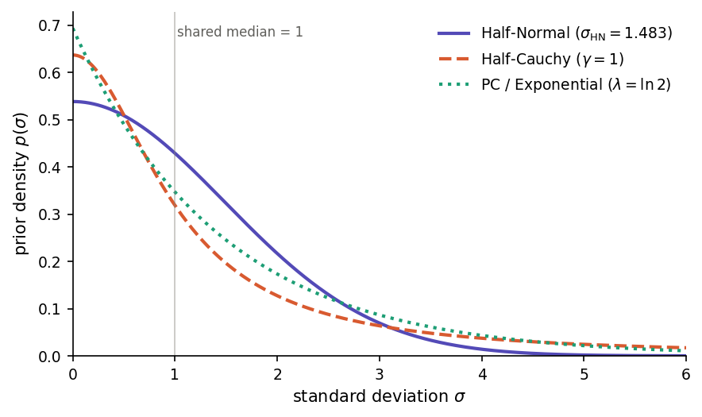

.. _analysis-view:

Statistical analysis
====================

Phonometrica provides a dedicated environment for fitting and comparing statistical models.
To open an analysis, create one from a concordance or dataset using the **Analyze** command,
or open an existing ``.phon-analysis`` file. The analysis view is divided into three areas:
a **top bar** for entering formulas, a **left panel** with column and model lists, and a
**right panel** with tabs for results, post-hoc tests, diagnostics, and exploratory plots.

Support for statistical modeling was introduced in version 0.9. The core estimation
engines (covering fixed-effects Linear, Binomial, and Poisson regressions) were implemented manually by the lead author.
More specialized modules, including Negative Binomial regression, Mixed-Effects models, and Bayesian inference, along with post-hoc tests 
and residual diagnostics, were developed with the assistance of Claude Opus 4.6 (as of April 2026) using algorithmic guidance 
from established literature and reference implementations in R.

While our internal benchmarking shows an excellent match across a diverse suite of datasets when compared to reference R packages 
(such as lme4, glmmTMB and brms), these features are provided without a guarantee of absolute numerical parity. Users may encounter minor
discrepancies due to differences in optimization algorithms, convergence criteria, or numerical stability in edge cases. We welcome community feedback and detailed bug
reports.

.. note::
   **Generalized additive models (smooth terms).** Phonometrica supports ``s()`` smooth
   terms — cubic regression splines and random-effect smooths — but this support is currently
   experimental. Fits agree qualitatively with the ``mgcv`` R package (significance of
   smooths, broad shape of fitted curves, EDF ordering across terms) but may
   differ numerically. The ``log(λ)`` value reported by ``model.smooth_log_lambda``
   is not directly comparable to ``log(m$sp)`` from ``mgcv``, and EDF/F
   statistics may differ from ``mgcv`` at extreme penalty regimes (very
   smooth or very wiggly fits). For applications where mgcv-equivalence is required, we recommend
   exporting your data and running the model in R until this is resolved.
   Smooths are otherwise fully integrated with the rest of the analysis
   pipeline: posterior predictive checks, model comparison, plotting, and
   prediction at new x-values all work as expected.

Top bar
-------

The top bar contains the following elements:

- **Formula**: an editable text field where you enter your model formula using R-style syntax
  (e.g. ``F1 ~ vowel + context``). Press Enter or click **Fit** to fit the model.
- **Outcome**: a drop-down menu to select the type of response variable: Continuous (for
  measurements such as formant frequencies or durations), Continuous (robust) (for continuous
  measurements that may contain outliers, such as formant values with tracking errors),
  Binary (for binary outcomes such as
  present/absent), Count (for count data), Overdispersed count (for count data with extra
  variability), or Proportion (for values strictly between 0 and 1). Hover over each option
  to see the corresponding statistical family and link function.
- **Fit**: fits the model described by the current formula and outcome type. The fitted model is
  added to the model list.
- **Estimation**: choose between **Frequentist** (maximum likelihood with Wald-based *p*-values,
  the default) and **Bayesian** (approximate Bayesian inference with weakly informative priors,
  reporting posterior means, credible intervals, and probability of direction). See
  `Bayesian estimation`_ below.
- **Fitting options** (|settings|): a gear-icon popup with additional controls — default
  estimation type, maximum number of optimizer iterations, and (for Gaussian linear mixed
  models) the choice between **ML** and **REML**. See `Frequentist estimation method (ML/REML)`_
  below.
- **Help** (|help|): opens this documentation page.

Formula syntax
--------------

Phonometrica uses R-style formula syntax. The left-hand side is the response variable, and
the right-hand side lists the predictors separated by ``+``.

Fixed effects
~~~~~~~~~~~~~

- ``y ~ a + b``: additive effects of *a* and *b*
- ``y ~ a * b``: equivalent to ``y ~ a + b + a:b`` (main effects plus their interaction)
- ``y ~ a:b``: interaction only, without the main effects
- ``y ~ 0 + a`` or ``y ~ a - 1``: remove the intercept

Smooth terms (GAM)
~~~~~~~~~~~~~~~~~~

Smooth terms fit penalized regression splines, which capture nonlinear relationships without
requiring you to specify the shape of the curve in advance. They are useful when a predictor's
effect on the response is not a straight line — for instance, formant values that change
nonlinearly over the course of a vowel.

Basic syntax:

- ``y ~ s(x)``: penalized regression spline of the numeric variable *x* (default: 10 knots, cubic regression spline basis)
- ``y ~ s(x, k=15)``: spline with 15 knots (increase *k* if you expect a highly wiggly pattern)
- ``y ~ s(x, by=group)``: a separate smooth for each level of the factor *group*

Basis types
^^^^^^^^^^^

Phonometrica supports two basis types, selected with the ``bs`` argument:

**Cubic regression splines** (``bs=cr``, the default). A ``bs=cr`` smooth models a nonlinear
relationship between a numeric covariate and the response. The basis consists of natural
cubic spline functions evaluated at *k* knots placed at quantiles of the covariate. The
penalty is the integrated squared second derivative of the curve, which measures
*wiggliness*: higher smoothing parameters produce smoother curves, and in the limit the
smooth reduces to a straight line. The penalty has rank *k* − 2, because the penalty null
space — the set of functions with zero second derivative — is the family of straight lines
(intercept + slope), which are left unpenalized. An identifiability constraint (sum-to-zero
across the data) is absorbed into the basis, reducing the effective dimension from *k* to
*k* − 1. This ensures the smooth is identifiable in the presence of a model intercept.

For example::

   F1 ~ vowel + s(duration)
   F1 ~ vowel + s(duration, k=20)

**Random effects** (``bs=re``). A ``bs=re`` smooth models group-level deviations for a
categorical factor. The basis is an indicator matrix (one column per level), and the
penalty is the identity matrix, which shrinks all group adjustments toward zero. This is
mathematically equivalent to a random effect with variance σ²_u = σ²_ε / λ, where λ is
the smoothing parameter estimated by GCV (Generalized Cross-Validation, an efficient
approximation to leave-one-out cross-validation that selects the degree of smoothing by
minimizing prediction error). The key difference from ``bs=cr`` is that
``bs=re`` does not model a smooth curve — it models a set of discrete group-level
adjustments.

Random intercepts and random slopes
^^^^^^^^^^^^^^^^^^^^^^^^^^^^^^^^^^^^

The ``bs=re`` basis supports two kinds of random effects:

**Random intercepts**: ``s(speaker, bs=re)`` gives each speaker a constant adjustment to the
response. This is the GAM equivalent of ``(1|speaker)`` in a mixed model.

**Random slopes**: ``s(speaker, by=duration, bs=re)`` gives each speaker a different slope
for the numeric variable *duration*. This is the GAM equivalent of ``(0 + duration | speaker)``
in a mixed model. Note that the ``by`` argument has a different meaning here than for
``bs=cr``: for ``bs=cr``, ``by=factor`` fits a separate smooth per factor level; for
``bs=re``, ``by=numeric`` scales the group indicators by the covariate value.

To model both random intercepts and random slopes for the same grouping variable, include
two separate ``bs=re`` terms. This gives **uncorrelated** random effects (each with its own
smoothing parameter)::

   F1 ~ vowel + s(duration) + s(speaker, bs=re) + s(speaker, by=duration, bs=re)

.. note::

   **Why two terms instead of one?** Unlike the mixed-model syntax where
   ``(1 + duration | speaker)`` bundles intercept and slope into a single term, the GAM
   framework requires separate smooth terms because each one has its own smoothing parameter
   (and therefore its own variance component), estimated independently by GCV. The formula
   ``s(speaker, bs=re) + s(speaker, by=duration, bs=re)`` is the standard way to express
   this in mgcv and in Phonometrica. Removing the slope variable from the formula (e.g.
   right-clicking *duration* and choosing *Remove from formula*) will remove the slope term
   while leaving the random intercept in place.

You can also cross grouping factors::

   F1 ~ vowel + s(duration) + s(speaker, bs=re) + s(item, bs=re)

.. note::

   **When to use** ``bs=re`` **vs** ``(1|group)``. Both express random intercepts, but they
   go through different estimation paths:

   - ``s(speaker, bs=re)`` is estimated in the **penalized regression** (GAM) framework via GCV.
     Use this when your model already includes smooth terms like ``s(duration)``.
   - ``(1|speaker)`` is estimated in the **mixed model** framework via Laplace approximation.
     Use this when your model has only parametric fixed effects (no smooth terms).

   Combining ``s()`` smooth terms with ``(1|group)`` random effects in the same formula is not
   currently supported. If you need both a nonlinear smooth and grouping structure, use
   ``bs=re`` for the grouping.

.. note::

   **Correlated vs uncorrelated random effects.** Two separate ``bs=re`` terms for the same
   group (one for intercepts, one for slopes) produce uncorrelated random effects — the
   correlation between a speaker's intercept adjustment and slope adjustment is assumed to be
   zero. This is analogous to fitting two separate ``(0 + ... | group)`` terms in lme4. If
   you need correlated random intercepts and slopes, use the mixed-model syntax
   ``(1 + x | group)`` with parametric fixed effects instead of smooth terms.

.. note::

   **Choosing** *k* **for spline smooths.** The default of *k* = 10 works well in most
   situations. If you suspect the relationship is very wiggly (e.g. a formant contour with
   multiple turning points), increase *k* to 15 or 20. Setting *k* too high is not harmful —
   the penalty will prevent overfitting — but it makes computation slower. Setting *k* too low
   can prevent the model from capturing genuine patterns. A useful rule of thumb: if the EDF
   reported in the summary is close to *k* − 1, consider increasing *k*.

Random effects
~~~~~~~~~~~~~~

- ``y ~ a + (1 | speaker)``: random intercept for *speaker*
- ``y ~ a + (1 + a | speaker)``: random intercept and correlated random slope for *a*
- ``y ~ a + (0 + a | speaker)``: random slope only (no random intercept)

Nested random effects are also supported, in either of the two forms used by lme4:

- ``y ~ a + (1 | school/classroom)``: slash sugar — expands at parse time to
  ``(1 | school) + (1 | classroom:school)``. The chain follows the lme4 convention
  with the inner factor on the left of the synthetic name. Multi-level chains
  work the same way: ``(1 | g1/g2/g3)`` expands to ``(1 | g1) + (1 | g2:g1) + (1 | g3:g2:g1)``.
- ``y ~ a + (1 | school) + (1 | school:classroom)``: explicit form. The bare-colon
  ``(1 | g1:g2)`` term creates a synthetic grouping factor over the observed pairs
  of values; the order of names is preserved as written.

Either form fits the same model; they differ only in how the random-effect SD is
labelled in the summary table — slash sugar produces ``sd(Intercept|classroom:school)``
(matching ``glmmTMB``'s ``VarCorr()`` output), while the explicit form preserves whatever
order you typed.

.. note::

   **Implicit nesting via unique labels.** If your inner factor is already
   coded with globally unique levels (e.g. classroom IDs that are unique
   across schools), then ``(1 | school) + (1 | classroom)`` is also a valid
   nested specification — the synthetic group form is not needed. If the
   inner labels collide across outer levels (e.g. *Class 1* exists in every
   school), you must use the synthetic or slash form so that Phonometrica
   knows to disambiguate the grouping by the outer factor.

You can combine fixed effects with smooth terms, or fixed effects with random effects.
To combine smooth terms with grouping structure, use ``s(group, bs=re)`` (see above).

Columns panel
-------------

The left panel lists all the columns available in the source data.

- **Double-click** a column to add it as a fixed-effects predictor.
- **Right-click** a column to open a context menu with the following options:

  - *Set as response*: place this column on the left-hand side of the formula.
  - *Remove from formula*: remove this variable from the formula.
  - *Add as predictor*: add as a fixed-effects term.
  - *Add with main effects and interaction*: create an ``a * b`` term with another variable already in the formula.
  - *Add interaction only with...*: create an ``a:b`` interaction term without adding main effects.
  - *Add as smooth*: (numeric columns only) add a smooth term ``s(x)`` with preset or custom *k*.
    A submenu offers *with by variable* to create ``s(x, by=factor)`` terms.
  - *Add as grouping factor*: add a random intercept ``(1 | group)`` for mixed-effects models.
  - *Add as nested grouping factor in...*: (submenu) for an inner factor like ``classroom``,
    nest it inside an existing grouping factor like ``school``. Appends a term
    ``(1 | school:classroom)`` to the formula, leaving any existing ``(1 | school)`` term
    in place. The combined model is equivalent to lme4's ``(1 | school/classroom)``.
    The submenu lists existing top-level grouping factors; synthetic groups already
    nested are not offered (edit the formula directly to extend such a chain).
    If the outer term carries random slopes, e.g. ``(1 + time | school)``, the slopes
    are *not* propagated onto the synthetic group — to do that, edit the formula by
    hand to use the slash form.
  - *Add smooth for grouping*: (categorical columns only) add a penalized random intercept
    ``s(group, bs=re)`` for use in GAM models.
  - *Add smooth for random slope in...*: (categorical columns only) add a penalized random
    slope ``s(group, by=numeric, bs=re)`` for use in GAM models. A submenu lists the
    available numeric columns as slope variables.
  - *Add correlated slope in...*: add this variable as a random slope inside an existing random term
    (e.g. ``(1 + a | speaker)``).
  - *Add independent slope in...*: add this variable as a random slope in a new random term
    for the same group (e.g. ``(0 + a | speaker)``).
  - *Set reference level...*: (categorical columns only) choose which level is used as the
    reference for treatment contrasts. By default, the alphabetically first level is used.

A small check mark appears next to columns that are currently used in the formula.

Models panel
------------

Below the columns panel, the **Models** list shows all fitted models. Clicking a model displays
its summary, diagnostics, and EDA plots. You can select multiple models using Ctrl+click or
Shift+click.

- **Delete**: remove the selected model from the analysis.
- **Compare**: run pairwise likelihood ratio tests on the selected models (or all models if
  fewer than two are selected). See `Model comparison`_ below.

Summary tab
-----------

The Summary tab displays detailed results for the selected model:

- **Coefficient table**: estimated coefficients, standard errors, test statistics (*t*-values
  for Gaussian models, *z*-values for GLMs), and *p*-values with significance codes.
- **Goodness of fit**: AIC, BIC, and log-likelihood.
- **Gaussian models**: residual standard error, R², and adjusted R².
- **Smooth terms** (GAM): a separate table showing effective degrees of freedom (EDF),
  reference degrees of freedom, *F*-statistic, and approximate *p*-value for each smooth.
- **Random effects** (mixed models): variance and standard deviation for each random term,
  plus the covariance structure (correlations between random slopes).
- **Pseudo R²** (mixed models): Nakagawa & Schielzeth (2013) marginal and conditional R².
  The marginal R² measures the proportion of variance explained by fixed effects alone;
  the conditional R² measures the proportion explained by both fixed and random effects.
  Computed for all families (Gaussian, Binomial, Poisson, Negative binomial, Student *t*)
  using the appropriate distribution-specific variance.

The toolbar above the summary provides:

- **Copy to clipboard**: copy the summary text.
- **Save as text**: save the summary to a plain text file.
- **Save as LaTeX table**: export the coefficient table in LaTeX format.
- **Show random effects**: (enabled only for mixed-effects models) when checked, the summary
  includes a table of conditional modes (BLUPs) for each grouping factor. Each row shows one
  level of the grouping variable (e.g. one speaker) and the estimated deviation from the
  population mean for each random term (intercept, slopes).

  Conditional modes are best linear unbiased predictors (BLUPs) of the random effects, also
  known as *ranef* in R's lme4 terminology. They represent each group's estimated deviation
  from the population-level fixed effects. For example, a positive random intercept for
  speaker *A* means that speaker *A*'s response is estimated to be higher than the population
  mean, after accounting for the fixed effects.

  .. note::

     Conditional modes are shrinkage estimates: they are pulled toward zero relative to
     simple group-level means, with more shrinkage for groups with fewer observations or
     higher residual variance. This is a desirable property — it reduces overfitting to
     small groups.

Post-hoc tab
------------

The Post-hoc tab provides estimated marginal means (EMMs) and pairwise contrasts for the
categorical factors in the selected model. This is the standard approach for post-hoc
analysis in linear and generalized linear models.

The toolbar at the top of the tab contains the following controls:

- **Factor**: select the categorical variable for which to compute EMMs or trends.
- **Trend**: select a numeric variable to estimate its slope at each level of the factor
  (emtrends mode). Leave as "(None)" for standard estimated marginal means.
- **Adjustment**: the method used to correct *p*-values for multiple comparisons:

  - *Holm* (default): Holm's step-down procedure. Uniformly more powerful than Bonferroni
    while still controlling the family-wise error rate.
  - *Bonferroni*: multiply each *p*-value by the number of tests.
  - *None*: no adjustment (raw *p*-values).

- **Confidence**: the confidence level for intervals (default: 0.95).

Estimated marginal means
~~~~~~~~~~~~~~~~~~~~~~~~~

EMMs are population-averaged predictions at each level of the target factor. Other categorical
factors in the model are balanced (equal weight across their levels), and numeric covariates
are held at their observed means. This ensures that the estimated means are not biased by
unequal sample sizes or covariate imbalances.

The upper table displays:

- **Level**: each level of the selected factor.
- **EMM**: the estimated marginal mean on the response scale.
- **SE**: the standard error.
- **Lower CI** / **Upper CI**: confidence interval bounds.

For models with a non-identity link function (e.g. logistic or Poisson regression), two
additional columns show the link-scale EMM and SE. The response-scale CIs are obtained by
back-transforming the link-scale CI endpoints through the inverse link function, which
produces asymmetric but more accurate intervals than the delta method.

Emtrends mode
~~~~~~~~~~~~~

When a numeric variable is selected in the **Trend** dropdown, the tab switches to
*emtrends* mode. Instead of estimated marginal means, it computes the slope (trend) of
the selected continuous variable at each level of the factor.

This is useful for testing whether a continuous effect differs across groups. For example,
with the model ``F2 ~ frequency * group``, selecting Factor = "group" and Trend = "frequency"
will estimate the slope of frequency for each group. The pairwise contrasts then test
whether these slopes differ significantly.

Trends are reported on the link scale. For Gaussian models with identity link, these are
the response-scale slopes (e.g. Hz per unit of frequency). For models with a log or logit
link, they represent the change in the linear predictor per unit of the trend variable
(e.g. change in log-odds per unit of frequency for logistic regression).

Pairwise contrasts
~~~~~~~~~~~~~~~~~~

The lower table shows all pairwise differences between levels, with columns for:

- **Contrast**: the pair being compared (e.g. "a - i").
- **Estimate**: the difference between the two EMMs (or trends) on the link scale.
- **SE**: the standard error of the contrast, accounting for the covariance between EMMs.
- **t value** or **z value**: the Wald test statistic (t for Gaussian fixed-effects
  models, z for GLMs and mixed models).
- **p value**: the *p*-value after adjustment for multiple comparisons.

Significant contrasts (*p* < 0.05) are highlighted in bold. Significance codes
(\*\*\* < 0.001, \*\* < 0.01, \* < 0.05, . < 0.1) appear in the rightmost column.

Mathematical background
~~~~~~~~~~~~~~~~~~~~~~~

EMMs are computed following Searle, Speed & Milliken (1980), using the terminology
of Lenth (2016). For a model with fixed-effects coefficient vector :math:`\boldsymbol{\beta}`
and covariance matrix :math:`\mathbf{V}`, the EMM for each level is a linear function
:math:`\mathbf{L}\boldsymbol{\beta}` where :math:`\mathbf{L}` is a prediction matrix (the
"reference grid"). Standard errors are obtained from

.. math::

   \mathrm{SE} = \sqrt{\mathrm{diag}(\mathbf{L}\,\mathbf{V}\,\mathbf{L}^{\top})},

and confidence intervals use the appropriate :math:`t` or :math:`z` quantiles.

For generalized linear models, response-scale standard errors are computed via the
delta method, and confidence intervals use endpoint back-transformation through the
inverse link function.

.. note::

   EMMs for mixed-effects models use the fixed-effects coefficients only. Random effects
   integrate out to zero at the population level and do not contribute to the EMMs.
   The covariance matrix is the conditional variance
   :math:`\mathrm{Var}(\hat{\boldsymbol{\beta}} \mid \hat{\boldsymbol{\theta}})` from the
   Henderson system, which is the same quantity reported by lme4 and glmmTMB in R.

Model comparison
----------------

Click **Compare** with two or more models selected (or with fewer than two selected to compare
all models). The comparison output has two parts:

**Information criteria table**

A table showing each model's formula, number of parameters, AIC, BIC, and log-likelihood,
sorted from simplest to most complex. Lower AIC and BIC indicate a better balance between
fit and parsimony. These criteria can be used for any pair of models, whether nested or not.

**Pairwise likelihood ratio tests**

For every pair of models, a likelihood ratio test (LRT) is computed:

- **Df**: difference in number of parameters between the two models.
- **Chisq**: the chi-squared test statistic, :math:`-2 \cdot (\log L_{\text{simple}} - \log L_{\text{complex}})`.
- **Pr(>Chisq)**: the *p*-value from the chi-squared distribution.

The LRT is only valid when the simpler model is **nested** within the more complex one
(i.e. the simpler model's terms are a subset of the more complex model's terms). Phonometrica
checks this automatically and issues a warning if models do not appear to be nested, suggesting
AIC or BIC instead.

When two models have the same number of parameters but different terms, the LRT cannot be
computed (Df = 0). The table shows ``--`` for these pairs.

.. note::

   The nestedness check is heuristic — it compares formulas at the symbolic level. In rare
   edge cases (e.g. aliased interactions, different contrast coding), it may produce false
   warnings. If you know your models are nested, you can safely ignore the warning.

.. note::

   **REML restrictions.** Comparing models with **Compare** enforces two hard rules when
   REML fits are involved:

   - Models fitted with different methods (one ML, one REML) cannot be compared at all —
     their log-likelihoods are not on the same scale. Refit with a consistent method.
   - REML-fitted models can only be compared to each other when they share the same
     **fixed-effects** design. Different fixed-effects designs would mean the two REML
     log-likelihoods are densities of different transformed datasets, which makes the
     comparison meaningless. To compare fixed-effects structures, refit all candidate
     models with ML.

   Both restrictions produce a clear error message with the recommended corrective action
   rather than silently ignoring the issue. Comparing REML models that differ *only* in
   their random-effects structure (same fixed effects) is allowed and is in fact the
   canonical use case for REML LRTs.

Effects plots
-------------

Once a model has been fit, the **Effects** tab in the analysis view shows the model's
implied effect of each predictor on the response, together with a confidence or credible
interval. Effects plots are typically the most intuitive way to interpret what a model says:
rather than reading off coefficient estimates from a table, you see the predicted response
at each value of a predictor of interest, with an error band around it.

Each plot answers a question of the form: *"Holding the other predictors fixed at typical
values, how does the response change as predictor X varies?"*

To see an effects plot, click the **Effects** tab on the right side of the analysis view
after fitting a model.

Choosing a predictor
~~~~~~~~~~~~~~~~~~~~

The **Predictor** drop-down at the top of the tab lists all the predictors in the model:
categorical predictors (such as ``vowel`` or ``gender``), numeric predictors (such as
``duration`` or ``age``), and any smooth covariates (terms entered as ``s(...)``). Pick one
and the plot updates immediately.

For a **categorical predictor**, the plot shows one point per level with a vertical error
bar at each. For a **numeric predictor** (or a smooth), it shows a curve with a translucent
band around it. The curve is evaluated at 100 evenly-spaced values across the observed
range of the predictor.

What "the others held fixed" means
~~~~~~~~~~~~~~~~~~~~~~~~~~~~~~~~~~

Computing the effect of one predictor requires a choice for every other predictor in the
model. A small italic caption under the plot title spells out what that choice is:

- **Numeric predictors** are held at their *observed mean* in your data.
- **Categorical predictors** are held at their *reference level* — the level that the model's
  intercept is built around (typically the first level alphabetically). This matches what
  R's ``ggpredict`` does by default.

These choices are deterministic from the model and the data: if you re-fit on the same data
and click the same predictor, you get the same plot.

Comparing levels of another factor: the **By** option
~~~~~~~~~~~~~~~~~~~~~~~~~~~~~~~~~~~~~~~~~~~~~~~~~~~~~

The **By** drop-down (next to **Predictor**) lets you split the plot by the levels of a
second categorical predictor. Instead of holding that predictor fixed, you get one curve
per level, drawn in different colours.

This is the most useful way to **visualize an interaction**. For a model like
``F2 ~ Position * Sexe``:

- Pick ``Position`` as the **Predictor** and ``Sexe`` as **By**.
- The plot shows two lines — one for each level of ``Sexe`` — across the levels of
  ``Position``.
- If the lines are *parallel* (same slope), there is essentially no interaction between
  ``Position`` and ``Sexe``: the difference between the sexes is the same at every position.
- If the lines *diverge or cross*, there is an interaction: how ``Position`` affects ``F2``
  depends on which sex you look at.

The **By** option is useful even when the model is purely additive (no ``*`` or ``:`` in the
formula): it produces parallel curves, which is itself an informative sanity check.

How to read the error band
~~~~~~~~~~~~~~~~~~~~~~~~~~

The shaded band (numeric predictor) or the vertical bar (categorical predictor) shows a
95% interval around the predicted value. By default this is a 95% interval; the underlying
``predict()`` function lets you change the coverage (see the scripting documentation).

The interpretation of the interval depends on the model:

- For **Frequentist** models, the interval is a 95% **confidence interval** for the mean
  response at that predictor value: under repeated sampling, an interval computed this way
  would contain the true mean about 95% of the time.
- For **Bayesian** models, the interval is a 95% **credible interval**: there is a 95%
  posterior probability that the true mean lies in this range, given the data and the
  priors.

The caption under the title flags which interpretation applies.

Mixed-effects models
~~~~~~~~~~~~~~~~~~~~

For models with random effects (terms like ``(1|speaker)``), the default plot shows what is
called a **population-level prediction**: the predicted response for an "average" speaker,
in the sense that the random effects are set to zero. This represents what the model
expects on average across the population sampled, and is the right summary for a question
like *"How does F1 vary with vowel, in general?"*.

It is *not* the predicted value for any specific speaker. To see per-speaker predictions,
use the **Random** and **Levels** controls described below.

The caption under the plot title says *"Population-level (random effects = 0)"* whenever
the population-level prediction is shown.

Conditional prediction: per-group curves
~~~~~~~~~~~~~~~~~~~~~~~~~~~~~~~~~~~~~~~~

The **Random** drop-down lets you switch from population-level prediction to a
**conditional prediction**, where each curve corresponds to a specific level of a
random-effects grouping factor (for example, one curve per speaker). This is the right
mode for answering questions like *"How much do speakers differ from each other?"* or
*"Does the effect of position go in the same direction for every speaker?"*.

To use it: pick a grouping factor from the **Random** drop-down (e.g. ``speaker``). The
**Levels** checklist next to it then shows every level of that factor — every speaker, in
the running example. By default all levels are checked. Uncheck individual levels to
declutter the plot, for example to compare half a dozen specific speakers in detail.

When **Random** is set to a grouping factor:

- The **By** drop-down is disabled. Stratifying the plot by a fixed-effect category and
  by random-effect levels at the same time produces a 2D grid of curves that doesn't fit
  on a single set of axes — that's a planned future feature ("subplots per level"), not a
  v1.0 capability.
- The **Show CI** checkbox is unchecked by default, because overlapping confidence ribbons
  for many speakers quickly become visually unreadable. Re-check it when you want to see
  each curve's uncertainty (typically with a small number of selected levels).
- The **Show legend** checkbox is checked by default when the group has eight or fewer
  selected levels, and unchecked when there are more (a long legend would consume too much
  of the plot). You can override either default.

The plot title flips to ``Effect of <focal> by <group> (conditional)``, and the caption
under it reads ``Conditional on <group> (N levels) — predicted/posterior mean; …``,
reminding you which interpretation applies.

What conditional prediction means precisely
~~~~~~~~~~~~~~~~~~~~~~~~~~~~~~~~~~~~~~~~~~~

For each level of the random-effects grouping factor (each speaker, say), Phonometrica
computes the predicted value as ``X·β + Z·u``, where ``Z·u`` is the speaker's contribution
from the fitted BLUPs (Best Linear Unbiased Predictors — the model's estimate of how this
particular speaker deviates from the population mean). This is the same calculation that
``lme4``'s ``predict.merMod`` and ``glmmTMB``'s ``predict(re.form = NULL)`` perform by
default. The uncertainty interval treats the BLUPs as fixed and reflects only fixed-effect
uncertainty, matching those packages' default behaviour.

For a model with a **random intercept only** (e.g. ``f1 ~ vowel + (1|speaker)``), the
per-speaker curves are vertically translated copies of each other — they have the same
shape, just shifted up or down by each speaker's intercept BLUP. Speakers with positive
BLUPs sit above the population-level curve; speakers with negative BLUPs sit below.

For a model with **random slopes** (e.g. ``f2 ~ position + (1+position|speaker)``), the
per-speaker curves are no longer parallel — they fan out, because each speaker has both
their own intercept *and* their own slope on the focal predictor. This is exactly the
visualization to use to answer *"Do all speakers shift their F2 in the same way across
positions, or does the magnitude of the effect vary by speaker?"*.

Exporting
~~~~~~~~~

Click **Export...** to save the current plot as a PNG image, a PDF document, or an SVG
vector graphic. PDF and SVG produce sharp output suitable for publication; PNG is convenient
for slides and web pages.

When the tab is unavailable
~~~~~~~~~~~~~~~~~~~~~~~~~~~

A few model types are not yet supported. The Effects tab will show a short explanatory
message instead of a plot in these cases:

- Models with **by-factor smooths** (terms like ``s(x, by=group)``).
- Models with **random-effect smooths** (terms like ``s(g, bs="re")``).

For other limitations or for use cases not covered by the GUI, see the :func:`predict`
function in the scripting reference, which exposes the same machinery with finer-grained
control (custom reference grids, link-scale output, joining the predictions back into a
dataset, and so on).

Diagnostics tab
---------------

The Diagnostics tab helps you check whether the model's assumptions are met. A drop-down
menu lets you choose between four plot types:

- **Residuals vs Fitted**: plots raw residuals against fitted values. Look for random scatter
  around zero; patterns (e.g. a funnel shape) suggest violated assumptions.
- **Normal Q-Q**: compares residual quantiles to theoretical normal quantiles. Points close
  to the diagonal indicate normally distributed residuals.
- **Scaled Residuals vs Fitted**: uses simulation-based scaled residuals (see below), which
  should be uniformly distributed between 0 and 1 regardless of the model family.
- **Scaled Residuals Q-Q**: a Q-Q plot of the scaled residuals against the uniform distribution.

When a Bayesian model is selected, two additional plot types — *Posterior Predictive Check*
and *Posterior Densities* — appear in the drop-down. Both are described in
`Diagnostics tab (Bayesian mode)`_ below.

As in the EDA tab, the points in the four residual / Q-Q plots are linked to the source
dataset or concordance the model was fitted on. **Left-clicking** a residual or quantile
point opens the source data table and selects the corresponding observation, which is
useful for identifying which rows produce unusually large residuals or sit at the extremes
of a Q-Q plot. Click-to-source is unavailable for analyses loaded from ``.phon-analysis``
files saved before this feature was introduced; in that case the cursor stays as a normal
arrow.

Scaled residuals
~~~~~~~~~~~~~~~~

Traditional residuals (e.g. Pearson or deviance residuals) are difficult to interpret for
non-Gaussian models: their expected distribution depends on the response family and the
fitted values, so it is hard to tell whether an unusual pattern reflects a genuine model
problem or is simply an artefact of the distributional shape. Simulation-based *scaled
residuals* solve this problem by comparing each observed value to a set of values simulated
from the fitted model. Under a correctly specified model, the scaled residuals are uniformly
distributed between 0 and 1 regardless of the family, which makes them easy to interpret
visually and with formal tests.

Phonometrica computes scaled residuals using a procedure inspired by the DHARMa package in R
(Hartig, 2020). The steps are as follows:

1. For each of 1000 replicates, a new response vector is simulated from the fitted model.
   For mixed-effects models, the simulation is *unconditional* (marginal): fresh random effects
   are drawn from :math:`\mathcal{N}(\mathbf{0}, \hat{\boldsymbol{\Sigma}})` for each replicate,
   rather than conditioning on the estimated BLUPs.
   This is important because BLUPs are functions of the observed data — they absorb part of the
   residual noise via shrinkage — so conditioning on them would produce a predictive distribution
   that is systematically too narrow, resulting in underdispersed PIT residuals and inflated
   KS statistics (false positives). If the random-effects design information is unavailable
   (e.g. a model loaded from a file), Phonometrica falls back to conditional simulation using
   the fitted values directly.
2. For each observation, the observed value is ranked among its 1000 simulated counterparts.
   An observation that falls in the middle of the simulated range receives a residual near
   0.5; one that falls near the edge receives a residual close to 0 or 1.
3. For discrete response families (Binomial, Poisson, Negative binomial), a small random
   jitter is applied to break ties, following the *randomized quantile residuals* approach
   of Dunn & Smyth (1996). This ensures that the residuals are continuous and uniformly
   distributed even for discrete data.

When a scaled residual plot is shown, a **Residual tests** panel appears below the plot with
three formal tests:

- **Kolmogorov–Smirnov test**: tests whether the scaled residuals follow a uniform
  distribution. A significant result (small *p*-value) suggests that the model does not
  adequately describe the data.
- **Dispersion test**: compares the observed variance of the residuals to the theoretical
  variance of a uniform distribution (1/12). Values greater than 1 suggest overdispersion
  (more variability than the model predicts), while values less than 1 suggest
  underdispersion.
- **Outlier test**: counts how many residuals fall in the extreme tails (below 1/1001 or
  above 1000/1001 for 1000 simulations). Under a correct model, the expected number of outliers
  is approximately :math:`n \cdot 2/1001`, where :math:`n` is the number of observations. A
  significant excess of outliers may indicate influential observations or model misfit.

.. note::

   **Interpreting the tests.** Because the residuals are based on only 1000 simulation
   replicates, the tests have limited precision and their *p*-values may fluctuate across
   runs. A single borderline-significant result should not be cause for concern. Instead,
   look at the overall picture: do all three tests agree? Does the Q-Q plot show a clear
   pattern? A well-specified model will typically show non-significant results on all three
   tests, a dispersion ratio close to 1, and a Q-Q plot with points falling along the
   diagonal.

.. note::

   **Comparison with R.** Phonometrica's scaled residuals use unconditional (marginal) simulation
   for mixed-effects models: random effects are re-drawn from
   :math:`\mathcal{N}(\mathbf{0}, \hat{\boldsymbol{\Sigma}})` for each replicate. In R,
   the DHARMa package computes scaled residuals via ``simulateResiduals()``, which calls the
   model's ``simulate()`` method. The default behaviour depends on the package used to fit the
   model:

   - **glmmTMB**: ``simulate()`` draws new random effects by default (unconditional simulation),
     which matches Phonometrica's approach. Results should be directly comparable.
   - **lme4** (``lmer``/``glmer``): by default, ``simulate()`` also draws new random effects
     (unconditional). This matches Phonometrica. If you want to force conditional simulation in R
     (holding BLUPs fixed), pass ``re.form = NULL`` — but note that Phonometrica does *not* use
     conditional simulation by default.

   Because of differences in random number generators and the limited number of simulation
   replicates, individual test statistics and *p*-values are not expected to match exactly
   between Phonometrica and R. They should, however, lead to the same qualitative
   conclusions.

The **Export** button saves the current diagnostic plot to a file (PNG, PDF, or SVG).

EDA tab
-------

The Exploratory Data Analysis tab lets you visualize your data before fitting a model. It is
organized around four roles you can fill: a **plot type**, the **variables** that map to it,
the **overlay options** that customize what's drawn, and a **Customize dialog** for cosmetic
adjustments.

Choosing a plot type
~~~~~~~~~~~~~~~~~~~~

The **Plot type** combo at the top of the EDA controls selects what kind of chart to build:

- **Auto** (default) infers the chart from the variables you select. The original inference
  rules apply: Numeric × Numeric → scatter, Numeric × (none) → histogram, Categorical × Numeric
  → boxplot, Categorical × (none) → bar chart.
- **Histogram**, **Bar chart**, **Boxplot**, **Scatter** force a specific chart. If the
  selected variables don't fit (e.g. Histogram with a categorical X), a short hint appears
  below the plot — for instance, *"Histogram needs a numeric X; "survey" is categorical."* —
  and the variable combos stay populated so you can fix the selection without losing context.
- **Formant chart** is a Scatter with axes reversed by convention (high values at the
  bottom-left, as in F1 × F2 plots). The X and Y slot labels rename to **F2:** and **F1:**
  as a reminder, and the redundant Formant checkbox is hidden.

Switching the plot type clears every variable slot (X, Y, Group, Facet, Pool, Style, Label)
so prior selections from a different chart don't carry over and produce surprising results.
Any customization you set via the Customize dialog (see below) is also reset on type change.

Variables
~~~~~~~~~

Variable slots adapt to the active plot type:

- **X** and **Y**: the primary axes. Required by all plot types except those that take
  only X (Histogram, Bar chart).
- **Group**: split the data within each panel into colored subseries. Works for every
  plot type:

  - In **Histogram**, groups appear as overlaid translucent fills with their own legend.
  - In **Bar chart**, groups appear as side-by-side (dodged) sub-bars.
  - In **Boxplot**, groups appear as side-by-side boxes clustered by primary X level.
  - In **Scatter** / **Formant chart**, groups encode color (and, with Style, marker shape).

- **Facet**: split the plot into one panel per level of a categorical variable (small
  multiples). All four chart types support it. Group and Facet combine: facet by speaker,
  group by condition → overlaid histograms per speaker. By default panels are laid out
  near-square with a cap of four columns per row so each panel stays readable; you can
  override the column count via Customize.
- **Pool by** *(Scatter / Formant chart with Group set)*: average X and Y values within
  each (group, pool) cell before plotting — e.g. pool by speaker to get one point per
  speaker per vowel.
- **Style** *(Scatter / Formant chart with Group set)*: differentiate marker shape (and
  ellipse line style) by a second categorical variable. Color continues to encode Group.
- **Label** *(Scatter)*: render the value of a variable as text at each data point.

Overlay options
~~~~~~~~~~~~~~~

Which overlays are visible depends on the active plot type and the variable selection.

Histogram:

- **Bins**: histogram bin count (0 = automatic, using Sturges' rule).
- **Density curve**: overlay a kernel density estimate. When Group is set, one curve is
  drawn per group, colored to match its bars and scaled to that group's count so curve
  heights match the matching group's bars. When Facet is set, each panel gets its own
  curve(s).
- **Smoothing**: bandwidth adjustment factor for the density curve (1.00 = Silverman's
  rule of thumb).

Scatter and Formant chart:

- **Regression line** *(Scatter)*: overlay an OLS regression line. Hidden for Formant
  charts where a global regression isn't meaningful.
- **Means**: show the mean of each group as a marker.
- **Ellipses**: draw confidence ellipses around each group with an adjustable confidence
  level (default 68% ≈ 1σ for plain Scatter; 95% for Formant chart).
- **Formant** *(Scatter only)*: reverse both axes. Equivalent to choosing the Formant
  chart plot type but lets you toggle the convention on top of a plain Scatter setup;
  hidden when the type is already Formant chart.

Raw formant charts (clouds with no overlay) are useful too — Mean and Ellipse default to
OFF when you switch to the Formant chart type. Enable them after you see the cloud if the
centroids and confidence ellipses would help.

Customize dialog
~~~~~~~~~~~~~~~~

The gear button in the EDA toolbar opens a Customize dialog that overrides cosmetic and
layout aspects of the current plot:

- **Title**: replace the auto-generated title (e.g. *"F2 by gender"*).
- **X label**, **Y label**: replace the auto-generated axis labels (typically the variable
  names).
- **X range**, **Y range**: override the auto-fit range with explicit min/max. Both bounds
  must be set for the override to take effect; leaving either blank falls back to auto-fit
  on both axes. Inverted min/max are silently swapped. Comma decimal separators (e.g.
  *"1,5"*) are accepted alongside dot separators.
- **Facet columns**: number of panels per row in faceted layouts. 0 means auto (capped at
  4 for readability); any positive value is used as-is.

A **Reset** button clears all customizations. Customizations persist across variable
changes — if you re-pick X or Group, your title and labels remain — but reset automatically
on plot type change, since the auto-generated labels would no longer match the new chart.

Summary table
~~~~~~~~~~~~~

Below the plot, a summary table shows descriptive statistics (count, mean, standard deviation,
min, max) for the plotted variables, broken down by group if applicable.

The EDA plot can be **detached** into a resizable floating window using the maximize button
in the toolbar. It can be exported to PNG, PDF, or SVG via the **Save as...** menu.

Navigating from a plotted point to its source row
~~~~~~~~~~~~~~~~~~~~~~~~~~~~~~~~~~~~~~~~~~~~~~~~~

Each plotted observation in the EDA tab is linked back to the row of the source dataset or
concordance it was drawn from. Hovering over a clickable point changes the cursor to a hand,
and **left-clicking** the point opens the source data table — switching to its tab if it is
already open, or creating a new tab otherwise — and selects, scrolls to, and highlights the
corresponding row. This is useful for inspecting outliers, suspicious points, or any
observation whose context you want to verify before refining the analysis.

Which points are clickable depends on the plot type:

- **Scatter** and **grouped scatter**: every plotted point is clickable. In a faceted
  scatter, points remain clickable within each panel.
- **Box plot**: only the outlier dots are clickable. The box body itself summarises many
  observations and has no single source row.
- **Histogram** and **bar chart**: not clickable. Each bin or bar aggregates many rows.
- **Pooled grouped scatter** (when a *Pool by* variable is set): not clickable. Each plotted
  point is the mean of *N* source rows, so there is no single observation to highlight.

If the source data table is open with an active filter and the clicked observation is hidden
by that filter, Phonometrica displays a brief notice; clear the filter from the data view's
toolbar to inspect the row.

Supported model types
---------------------

Phonometrica's statistical engine supports the following model families:

- **Gaussian** (identity link): linear regression and linear mixed models (LMM).
- **Binomial** (logit link): logistic regression and logistic mixed models.
- **Poisson** (log link): Poisson regression and Poisson mixed models.
- **Negative binomial** (log link, NB2 parameterization): for overdispersed count data.
- **Beta** (logit link): for response variables that are proportions strictly between 0 and 1,
  such as voicing ratios, vowel-to-vowel coarticulation indices, or any measure expressed as a
  rate or proportion. The precision parameter φ is estimated jointly with the regression
  coefficients; higher φ indicates less variability around the mean proportion.
- **Student t** (identity link): robust regression and robust mixed models for continuous
  outcomes with heavy-tailed residuals. Useful when more observations are in the tails than would be expected
  under a Gaussian model. The model estimates two additional parameters: a scale parameter :math:`\sigma`
  and a degrees-of-freedom parameter :math:`\nu` that controls the tail heaviness. Observations with large
  residuals receive lower weight, so the fixed-effects estimates are robust to outliers. As
  :math:`\nu \to \infty` the model reduces to Gaussian regression; in practice, :math:`\nu < 10` indicates
  meaningful departure from normality.
  The engine fits Student-t models from multiple starting values for :math:`\nu` (covering the
  heavy-tailed-to-near-Gaussian range) and keeps the best converged fit, so users do not need to specify
  initial values for :math:`\nu` or :math:`\sigma`. If a fit produces an unusually
  large :math:`\nu` (:math:`\geq 199`), Phonometrica issues a warning indicating that the data are
  essentially Gaussian and recommends switching to the Gaussian family.
  Select **Continuous (robust)** in the Outcome dropdown to use this family, or pass ``"student"`` to
  the ``fit()`` scripting function.
- **GAM**: generalized additive models with penalized regression splines, including by-variable
  smooths, per-smooth significance tests, and random intercepts and random slopes via ``bs=re``
  to account for speaker/item grouping.

All model types support random intercepts and random slopes (mixed-effects models).
GAM models support grouping structure through ``s(group, bs=re)`` smooth terms (random
intercepts) and ``s(group, by=x, bs=re)`` terms (random slopes).

.. note::

   **Unified estimation via the Laplace approximation.** Phonometrica uses the Laplace
   approximation as a unified estimation framework for all models with random effects or
   dispersion parameters. In mixed-effects models, the random effects (speaker adjustments,
   item adjustments, etc.) are high-dimensional latent variables that must be integrated out
   of the likelihood. The Laplace approximation finds the most likely configuration of these
   latent variables and approximates the integral with a Gaussian centered at that peak. For
   Gaussian models, this approximation is exact; for non-Gaussian families, it is highly
   accurate in practice.

   Families with an additional dispersion parameter — negative binomial (θ), beta (φ),
   and Student *t* (σ, ν) — are always fitted through this unified engine, even without
   random effects. This ensures
   that the log-likelihoods of models with and without random effects are computed via the
   same optimization path, making AIC, BIC, and likelihood-ratio tests directly comparable.
   This follows the approach of `glmmTMB <https://CRAN.R-project.org/package=glmmTMB>`_ in R,
   where all models are fitted through the Template Model Builder regardless of whether
   random effects are present.

   When fitting a Bayesian Student-t regression model, Phonometrica reports a posterior distribution
   for the degrees-of-freedom parameter ν, which controls how heavy-tailed the residual distribution is.
   This posterior is computed using a numerical approximation (INLA) rather than full Markov chain Monte Carlo sampling.
   The approximation works well when the data are clearly non-Gaussian — for instance, when ν is estimated to be below 10,
   indicating substantial heavy-tailed behaviour — but tends to produce credible intervals for ν that are too narrow
   when the residuals are close to Gaussian (ν above roughly 30), in which case the data contain little information
   about ν and the true posterior is wide and diffuse. Concretely, if a full MCMC sampler such as Stan reports a 95%
   credible interval of [5, 195] for ν on a given dataset, Phonometrica may report something like [7, 55] for the same model.
   This does not affect the estimates or credible intervals for the regression coefficients, the random-effect standard
   deviations, or the model comparison scores (WAIC, LOO-IC), which remain reliable regardless of how well ν is identified.
   Users who need accurate uncertainty quantification specifically for ν in near-Gaussian models are advised to verify
   the result with an external MCMC tool. This is not a bug specific to Phonometrica: a validation experiment using
   500 simulated Gaussian observations confirmed that R-INLA, the reference implementation of the same class of
   approximation, produces an identical pattern (R-INLA mean = 20.1, 95% CI = [6.9, 55.5] where the correct posterior
   spans nearly the full prior range).

Frequentist estimation method (ML/REML)
---------------------------------------

For frequentist Gaussian linear mixed models, Phonometrica offers a choice between
**maximum likelihood (ML)** and **restricted maximum likelihood (REML)**. ML is the default
and applies to all model types. REML is an opt-in alternative for Gaussian models with at
least one random-effects term — for all other configurations (non-Gaussian families,
fixed-effects-only Gaussian, GAMs, Bayesian fits), REML is silently coerced to ML and a
note is attached to the model.

To switch a fit to REML, open the **Fitting options** popup (|settings|) next to the
**Fit** button and select **REML** in the **Method** dropdown. The dropdown is enabled only
when the current family is Gaussian and the formula contains a random-effects term; in any
other configuration it is greyed out with a tooltip explaining why.

When to use REML
~~~~~~~~~~~~~~~~

The two methods differ in how the variance components are estimated. ML treats the
fixed-effects parameters as known when estimating the variance components, which biases
the variance estimates downward in small samples. REML estimates the variance components
from a likelihood that has the fixed effects projected out, removing this bias. The
practical implications:

- **Fixed-effects estimates** :math:`\hat{\beta}` are *identical* under ML and REML. The
  difference lives entirely in the variance components and, through them, the standard
  errors of the fixed effects.
- **Standard errors and confidence intervals for fixed effects** are typically slightly
  larger under REML, reflecting the corrected variance estimates. This matters most when
  the number of random-effects groups (e.g. speakers) is small.
- REML is the **default in lme4** and `glmmTMB <https://CRAN.R-project.org/package=glmmTMB>`_;
  choosing REML in Phonometrica gives results that match these R packages numerically (to
  several decimal places on typical datasets).
- ML is the right choice when **comparing models with different fixed effects** via likelihood
  ratio tests, AIC, or BIC. REML log-likelihoods from models with different fixed-effects
  designs are not on the same scale and cannot be compared — Phonometrica enforces this
  with an error if you try (see `Model comparison`_ below).

A practical workflow: fit candidate models with ML to compare fixed-effects structures
(via AIC/BIC or LRT), then refit the final model with REML for the variance-component
estimates and the fixed-effects standard errors you report.

Output and reproducibility
~~~~~~~~~~~~~~~~~~~~~~~~~~

REML fits are tagged with a ``Method: REML`` line in the model summary, and the choice is
saved with the model. The **Refit** button on the model panel preserves the original
method, so a REML model stays REML after a refit.

In scripting, the method is selected via the ``fit_method`` option in the third argument
of ``fit()``:

.. code-block::

   let m_ml   = fit("f1 ~ gender + (1|speaker)", ds)
   let m_reml = fit("f1 ~ gender + (1|speaker)", ds, { "fit_method": "REML" })

The option key is ``fit_method`` rather than the more natural ``method`` because the
latter is a reserved keyword in the scripting engine. See the scripting API documentation
for full details.

Bayesian estimation
-------------------

Phonometrica supports approximate Bayesian inference as an alternative to frequentist
maximum-likelihood estimation. In Bayesian mode, the model reports posterior summaries
(posterior mean, credible intervals, probability of direction) rather than frequentist
*p*-values, and uses WAIC for model comparison instead of AIC/BIC.

To switch to Bayesian estimation, select **Bayesian** in the **Estimation** dropdown in the
top bar before clicking **Fit**. The model label in the Models panel will be marked with
**(B)** to distinguish Bayesian from frequentist fits.

When to use Bayesian estimation
~~~~~~~~~~~~~~~~~~~~~~~~~~~~~~~

Bayesian estimation can be useful in several situations:

- When you want to make probability statements about the parameters directly ("the
  probability that the effect of vowel height on F1 is positive is 0.997") rather than
  reasoning about hypothetical repeated sampling (*p*-values).
- When you have small samples or sparse grouping factors, where the regularization provided
  by priors can stabilize estimation and reduce overfitting.
- When *p*-values hover near conventional thresholds and you want a continuous measure of
  evidence (the probability of direction).
- When you want to compare non-nested models on a common information-theoretic scale (WAIC).

For most phonetics and sociophonetics applications with reasonably sized corpora, frequentist
and Bayesian estimates will agree closely. The Bayesian mode is most informative when the
data are limited or when you want to avoid the dichotomous logic of null-hypothesis
significance testing.

Priors
~~~~~~

Bayesian estimation requires prior distributions for the model parameters. Phonometrica uses
**data-dependent weakly informative defaults** following the approach of
`brms <https://CRAN.R-project.org/package=brms>`_ (Bürkner, 2017). These defaults are scaled
to the response variable so that they are genuinely weakly informative regardless of the
measurement scale (Hz, bark, semitones, milliseconds, etc.):

- **Fixed effects (slopes)**: :math:`\mathcal{N}(0, s)`, where
  :math:`s = \max\!\bigl(2.5,\; 2.5 \cdot \mathrm{sd}(y_{\text{link}})\bigr)`.
- **Intercept**: :math:`\mathcal{N}(\overline{y}_{\text{link}}, s)`, centered on the response mean.
- **Variance components** (random-effect SDs): Penalized complexity prior
  :math:`\mathrm{PC}(s, 0.05)`, meaning :math:`P(\sigma > s) = 0.05` (Simpson et al., 2017).
- **Residual SD** (Gaussian family): :math:`\mathrm{PC}(s, 0.05)`.
- **Dispersion parameters**: :math:`\mathrm{Gamma}(1, 0.01)` for negative binomial :math:`\theta`
  and beta :math:`\varphi`.

Here :math:`y_{\text{link}}` denotes the response on the link scale (identity for Gaussian/Student,
logit for binomial/beta, log for Poisson/NB). The priors are broad enough that they have
minimal influence on the posterior when the data are informative, but they prevent the
optimizer from wandering into implausible regions of the parameter space when the data are
sparse.

**Customizing priors.** When you select Bayesian estimation, a collapsible **Priors** panel
appears below the top bar. Each prior has an **Auto** checkbox (checked by default). Uncheck
it to enter custom values:

- *Fixed effects*: set the mean and standard deviation of the Normal prior applied to all
  slope coefficients. The intercept automatically receives a prior centered on the
  response mean.
- *Variance components*: choose among PC (penalized complexity), Half-Cauchy, or
  Half-Normal priors for the random-effect standard deviations, and set the scale parameter.
- *Residual*: same choices as variance components, for the residual SD (Gaussian only).

When **Auto** is checked, the italic text next to the Priors header shows the computed scale
value after fitting.

**Choosing a prior family.** Each of the three prior families puts its mode at zero and lives
on [0, ∞), so the relevant difference between them is tail behaviour — how aggressively they
shrink the random-effect SD toward zero and how much probability mass they assign to large
variances. The figure below plots all three priors with their scales calibrated so that the
median of each is σ = 1, making the differences in tail weight visible directly.

   Half-Normal, Half-Cauchy and PC (exponential) priors on a standard deviation σ, each
   calibrated so that the median equals 1.

**Half-Normal(s)** priors are truncated Gaussians, with density

.. math::

   p(\sigma) \propto \exp\!\left(-\frac{\sigma^{2}}{2 s^{2}}\right) \quad \text{for } \sigma \geq 0.

The Gaussian tail decays very fast, so values much larger than :math:`s` are
effectively ruled out a priori. This makes the prior informative: a misspecified :math:`s` can
bias the posterior SD downward. Use Half-Normal when you have genuine prior information
about a plausible upper bound on :math:`\sigma` — for example, when :math:`\sigma` is on a
log-odds scale and values above 5 are implausible on substantive grounds. Chung et al. (2013)
recommend Half-Normal specifically to avoid the degenerate :math:`\sigma = 0` estimates produced
by penalized-likelihood fits when the number of random-effect groups is small.

**Half-Cauchy(γ)** priors are truncated Cauchy distributions, with density

.. math::

   p(\sigma) \propto \frac{1}{\sigma^{2} + \gamma^{2}}.

The Cauchy tail decays only polynomially, so even with a small scale :math:`\gamma` the
prior keeps non-trivial mass at large :math:`\sigma`. This is the classical "weakly informative" default
recommended by Gelman (2006) for variance components in hierarchical models, and for many
years the default in tools such as Stan, rstanarm and brms. The Half-Cauchy is the most
permissive of the three: the data can override the prior even when the true SD is large.
Its weakness is the flip side of its strength — the tail is so heavy that with few
random-effect levels (say, 2–5 groups) the posterior can drift into implausibly large
variances and degrade the stability of the INLA grid integration. Use Half-Cauchy when you
have many random-effect levels and genuinely want the data to speak for themselves.

**PC(U, α)** priors (Simpson et al., 2017) reduce to an *exponential* distribution on the
standard deviation,

.. math::

   p(\sigma) = \lambda \, \exp(-\lambda \sigma).

The functional form is unsurprising; what makes
PC priors distinctive is their construction. They are derived from the Kullback–Leibler
divergence between the richer model (random effect with SD = :math:`\sigma`) and a simpler
*base model* (:math:`\sigma = 0`, i.e. no random effect at that level). Deviating from the base
model is penalized linearly in its natural Riemannian distance, and this penalty translates into
an exponential prior on the SD. The rate :math:`\lambda` is set through the interpretable
tail-probability statement :math:`P(\sigma > U) = \alpha`: you specify a plausible upper bound
:math:`U` and a small probability :math:`\alpha` of exceeding it, and the software solves

.. math::

   \lambda = -\frac{\ln(\alpha)}{U}.

PC priors combine the interpretability that Half-Normal lacks (you state a probability rather
than an abstract scale parameter) with the robustness that Half-Cauchy can over-supply
(exponential tails are lighter than Cauchy, so posterior mass cannot drift arbitrarily far from
the null). By construction they shrink the model toward the simpler structure, which is the
right behaviour when the random-effect structure is richer than the data can support. For these
reasons, PC priors are the default in R-INLA and in Phonometrica.

For routine analyses, keep the PC default. Switch to Half-Cauchy when you have substantive
reasons to expect large between-group variability and enough random-effect levels (roughly
10–15 or more) to identify it. Switch to Half-Normal only when you can justify a specific
scale on substantive grounds — otherwise its short tail can hide real variance components.
When you are unsure, the PC default is the most forgiving choice. It is always good practice
to refit with a different prior family as a sensitivity check: posterior summaries that
change substantially across priors indicate that the data are too sparse to pin down the
variance component, and results should be reported accordingly.

Estimation method
~~~~~~~~~~~~~~~~~

Phonometrica uses INLA-style approximate Bayesian inference (Rue, Martino & Chopin, 2009),
not Markov chain Monte Carlo (MCMC). This means that results are available in seconds rather
than minutes or hours, with no convergence diagnostics to worry about.

The estimation proceeds differently depending on the model structure:

**Fixed-effects models** (no random effects, no dispersion parameter): the frequentist MLE
is computed first, then a Gaussian posterior approximation is applied by combining the
Fisher information with the prior precision. This is exact for Gaussian linear models and
highly accurate for GLMs with moderate to large samples.

**Mixed-effects models and dispersion families** (NB, beta, Student *t*): the negative
log-posterior (likelihood × prior) is optimized directly, with the prior entering the
objective function. For mixed-effects models, a two-phase optimization finds the joint
posterior mode over fixed effects :math:`\boldsymbol{\beta}` and variance parameters
:math:`\boldsymbol{\theta}`.

.. note::

   **Optimizer dispatch.** The outer optimization over variance parameters
   uses Newton's method with a finite-difference Hessian (Levenberg–Marquardt
   damping applied when the Hessian becomes indefinite) for small-dimensional
   problems, and limited-memory BFGS (Liu & Nocedal 1989) for everything else.
   The threshold is set at outer dimension 4: random-intercept-only models
   with one or two grouping factors stay with Newton, while anything with
   random slopes or multiple crossed random intercepts switches to L-BFGS.
   Newton's quadratic convergence is preferred on trivial, well-conditioned
   surfaces; L-BFGS's secant-based curvature estimate is preferred on the
   curved ridges typical of larger models (e.g. a between-cluster fixed
   effect partially aliased with the corresponding random intercept).

   Both optimizers minimize the same Laplace-approximated marginal negative
   log-likelihood to the same tolerance (:math:`10^{-8}` on the gradient norm), with a
   secondary function-value convergence criterion for L-BFGS. Log-likelihood
   values agree across optimizers to within numerical noise (:math:`\sim 10^{-10}`),
   far below the threshold at which AIC differences or likelihood-ratio
   statistics are meaningful. The optimizer used for each fit is reported in
   the model summary (**Converged in N iterations (Newton)** or
   **(L-BFGS)**) and is accessible from scripts as ``model.optimizer``.

For mixed-effects models, the posterior is then refined via **grid integration** over the
hyperparameters :math:`\boldsymbol{\theta}` (variance component SDs, dispersion parameters).
This follows the INLA strategy:

1. A Hessian at the posterior mode defines a Gaussian approximation to the hyperparameter
   posterior.
2. A central composite design (CCD) grid of evaluation points is constructed in the
   standardized eigenspace of this Gaussian.
3. At each grid point :math:`\boldsymbol{\theta}_k`, the conditional posterior of the fixed
   effects :math:`\boldsymbol{\beta}` given :math:`\boldsymbol{\theta}_k` is computed, yielding
   a conditional mean :math:`\hat{\boldsymbol{\beta}}(\boldsymbol{\theta}_k)` and covariance
   :math:`\boldsymbol{\Sigma}(\boldsymbol{\theta}_k)`.
4. The results are combined into a mixture-of-Gaussians posterior, with weights proportional
   to the unnormalized posterior density at each grid point.

This grid integration provides full marginal posteriors for both the fixed effects and the
hyperparameters (variance component SDs, dispersion parameters, residual SD), capturing
uncertainty from the hyperparameters that a simple plug-in estimate at the mode would miss.

Summary tab (Bayesian mode)
~~~~~~~~~~~~~~~~~~~~~~~~~~~

When a Bayesian model is selected, the Summary tab displays posterior summaries instead of
frequentist test statistics:

**Coefficient table columns:**

- **Estimate**: the posterior mean of each coefficient.
- **Est.Error**: the posterior standard deviation.
- **l-95% CrI** / **u-95% CrI**: bounds of the 95% credible interval. Unlike frequentist
  confidence intervals, a credible interval has a direct probabilistic interpretation: given
  the data and the priors, there is a 95% probability that the parameter lies in this range.
  For mixed-effects models, these are quantiles of the mixture posterior (accounting for
  hyperparameter uncertainty), not of a single Gaussian.
- **pd**: the probability of direction, defined as
  :math:`\max\!\bigl(P(\beta > 0),\, P(\beta < 0)\bigr)`. This is the
  Bayesian counterpart to the frequentist *p*-value. A pd of 0.975 means there is a 97.5%
  posterior probability that the effect has the same sign as the estimate. Significance codes
  are based on pd thresholds: \*\*\* (:math:`\mathrm{pd} \geq 0.999`),
  \*\* (:math:`\mathrm{pd} \geq 0.99`), \* (:math:`\mathrm{pd} \geq 0.975`),
  . (:math:`\mathrm{pd} \geq 0.95`).

**Goodness of fit:**

- **WAIC** (Watanabe–Akaike information criterion): a Bayesian analogue of AIC that
  estimates the out-of-sample predictive accuracy of the model (Watanabe, 2010; Gelman,
  Hwang & Vehtari, 2014). Lower WAIC indicates better expected predictive performance.
  WAIC is reported with its standard error (SE) and the effective number of parameters
  (:math:`p_{\text{WAIC}}`), which measures model complexity on the posterior-predictive scale.
  WAIC is computed from 1000 posterior draws at fit time.
- **LPPD** (log pointwise predictive density): the sum of the log-predictive densities
  at each observation, averaged over the posterior.
  :math:`\mathrm{WAIC} = -2 \cdot \mathrm{LPPD} + 2 \cdot p_{\text{WAIC}}`.
- **LOO-IC** (leave-one-out information criterion): an alternative to WAIC based on Pareto
  Smoothed Importance Sampling (PSIS-LOO; Vehtari, Gelman & Gabry, 2017). Like WAIC, lower
  LOO-IC indicates better predictive performance. LOO-IC is reported with its standard error
  (SE) and the effective number of parameters (:math:`p_{\text{LOO}}`). LOO-IC is generally
  preferred over WAIC because it provides per-observation Pareto :math:`k` diagnostics (see
  below) that warn when the approximation is unreliable. When all :math:`k` values are below
  0.7, the LOO-IC estimate is considered reliable.
- **Pareto k diagnostics**: for each observation, a Pareto :math:`k` value measures the
  influence of that observation on the posterior. Phonometrica reports a summary of the Pareto
  :math:`k` distribution. Values below 0.5 are good, values between 0.5 and 0.7 are acceptable,
  and values above 0.7 indicate that the LOO-IC estimate for that observation is unreliable —
  in that case, WAIC may be preferred, or the model should be refit (e.g. with a different
  family or additional predictors to account for the influential observations).
- **Log-marginal likelihood**: the Laplace-approximated :math:`\log p(y \mid M)`, which can
  be used for Bayes factor computation between models.

**Hyperparameter posteriors:**

For mixed-effects models, the random-effects table reports posterior means and 95% credible
intervals for each variance component SD (e.g. sd(Intercept|speaker), sd(residual)),
obtained from the grid integration. For families with dispersion parameters, the table also
includes the posterior of :math:`\theta_{\text{NB}}`, :math:`\varphi_{\text{beta}}`, or
:math:`\sigma` and :math:`\nu` for Student *t*.

.. note::

   **Posterior mode, mean, and median.** For symmetric posteriors (typical with large
   samples), these three coincide. For small samples or skewed posteriors, they may differ.
   Phonometrica reports the posterior mean in the coefficient table (as does brms), but all
   three are stored internally and available via the scripting API. The posterior mode
   corresponds to the MAP (maximum *a posteriori*) estimate.

Post-hoc tab (Bayesian mode)
~~~~~~~~~~~~~~~~~~~~~~~~~~~~~

When a Bayesian model is selected, the Post-hoc tab reports estimated marginal means and
pairwise contrasts using posterior-based inference:

- **CrI** (credible intervals) replace confidence intervals in the EMM table.
- **pd** (probability of direction) replaces adjusted *p*-values in the contrast table.
  For each pairwise contrast,
  :math:`\mathrm{pd} = \Phi\!\bigl(|\hat{\delta}/\mathrm{SE}|\bigr)`, where :math:`\hat{\delta}`
  is the posterior mean of the contrast and SE is its posterior standard deviation.
- **No multiplicity adjustment** is applied, because pd is not a *p*-value and the
  family-wise error rate framework does not apply in the Bayesian context. The Adjustment
  dropdown is grayed out.

Diagnostics tab (Bayesian mode)
~~~~~~~~~~~~~~~~~~~~~~~~~~~~~~~

The four plot types described in the main `Diagnostics tab`_ section work the same
way for Bayesian models — the simulation-based scaled residuals, KS test, dispersion
test, and outlier test all use the same DHARMa-style procedure regardless of how the
model was fit. The residual tests panel reports frequentist *p*-values from the
simulation reference distribution; their interpretation is the same as in the
frequentist case.

For Bayesian models, two extra plot types appear in the drop-down:

- **Posterior Predictive Check**: a visual check of whether the response family you
  picked is appropriate for your data.
- **Posterior Densities**: density curves for each fixed-effect coefficient, showing
  the shape of the posterior distribution rather than just its mean and credible
  interval.

.. note::

   Earlier versions of Phonometrica reported posterior predictive *p*-values for the
   residual tests in Bayesian fits. That layer has been removed: the test statistic it
   used was based on conditional PIT residuals against the posterior-mean BLUP, which
   carried a built-in upward bias on the KS statistic (false-positive rate above
   nominal even when the marginal residuals were clean). The current diagnostics avoid
   this asymmetry by using the same unconditional reference distribution for both
   estimation methods. The visual Posterior Predictive Check below replaces what those
   *p*-values were trying to communicate.

Posterior predictive check
^^^^^^^^^^^^^^^^^^^^^^^^^^

Where the scaled-residual plots ask "are the model's residuals well-behaved?",
the posterior predictive check (PPC) asks the more direct question:

   *If I draw new datasets from the fitted model, do they look like my data?*

Whenever the answer is no, the response family or some other modelling choice is
missing a feature of the data. PPC is particularly useful for choosing between
likelihood families: it makes problems like heavy tails, an excess of zeros, or
boundary effects immediately visible.

The procedure is straightforward. Phonometrica draws 200 samples from the posterior
of the model parameters and, for each sample, simulates a complete new response
vector — a *replicate dataset* — from the model's likelihood. For mixed-effects
models, fresh random effects are drawn for each replicate (unconditional simulation,
exactly as for scaled residuals). The plot then compares the distribution of the
observed response with the distribution of the replicates, using a presentation
tailored to the response family.

**Continuous outcomes (Gaussian, Student t, Beta) — density overlay**

The dark curve shows the smoothed density of your observed *y*; the cloud of light
curves shows densities for 30 of the 200 replicates. If the dark curve sits
comfortably inside the cloud, the family captures the shape of your data well.

What to look for when the dark curve does *not* match the cloud:

- **Heavier tails** than the cloud — the dark curve has more mass in the extremes
  than the replicates produce. Common with Gaussian models on data with outliers
  or tracking errors. Try the **Continuous (robust)** outcome (Student *t*).
- **Asymmetry / skew** that the cloud cannot reproduce. Common with strictly
  positive measurements like duration or amplitude. Try a log-transform of the
  response, or — for values bounded in (0, 1) — switch to the **Proportion**
  outcome (Beta).
- **Bimodality** in the dark curve that is absent from the replicates. This often
  signals an unmodelled grouping factor (speaker, dialect, condition) — check
  whether a missing fixed or random effect would split the data into the two modes.

**Binary outcomes (Bernoulli binomial) — bar plot**

Two bars show the observed proportions of 0 and 1 in your data; vertical intervals
at each bar span the 5th to 95th percentile of those proportions across the
replicates. The bars should fall comfortably inside the intervals. A bar outside
its interval means the model is systematically over- or under-predicting the rate
of that outcome, which usually indicates a missing predictor.

**Counts (Poisson, negative binomial) — rootogram**

For each integer count value (0, 1, 2, …), a bar shows the square root of how many
observations took that value, and a marker with a 5–95% interval shows what the
model expects under the same √-transform. Square roots are used so that small
expected counts in the tails remain visible alongside large counts near the mode.

A bar protruding well above its interval means the model under-predicts observations
at that value; a bar falling well below the interval means the model over-predicts.
Poisson models typically struggle when there are too many zeros (the bar at *y* = 0
sticks far above its interval); switching to the **Overdispersed count** outcome
(negative binomial) usually fixes this.

The display caps the count axis at 50 to keep the plot readable; if your data has a
much longer tail, the display still shows the bulk of the support.

**Reading the check**

PPC is purely visual: there is no formal *p*-value, and that is by design. Posterior
predictive *p*-values are notoriously over-conservative — they concentrate around
0.5 even when the model is wrong (Gelman, Meng & Stern, 1996) — so reading the
overlay by eye is the practical approach. A model that produces replicate datasets
that look like your observed data is usable; a model whose replicates miss obvious
features of the data needs reconsideration.

.. note::

   **Cost.** Generating 200 replicate datasets and computing the family-appropriate
   summary takes noticeably longer than the residual plots, particularly for large
   datasets and mixed-effects models. The result is cached for the current model, so
   switching between the diagnostic plots does not retrigger the simulation.
   Refitting or selecting a different model invalidates the cache.

.. note::

   **What "200 draws" means here.** Posterior draws come from Phonometrica's grid
   approximation (see `Bayesian estimation`_ above) rather than from exact
   Hamiltonian Monte Carlo as in Stan or brms. For most models the visual overlay is
   indistinguishable from what brms produces; for models with strongly non-Gaussian
   posteriors or boundary effects, brms with HMC may show a slightly more
   informative spread, but the qualitative reading rarely differs.

Posterior densities
^^^^^^^^^^^^^^^^^^^

The **Posterior Densities** plot shows the marginal posterior distribution of each
fixed-effect coefficient as a smooth density curve. Each curve summarises *all* the
information about that coefficient that the data and prior together provide —
including its mean, its credible interval, and any asymmetry — in a single picture.

The **Predictors** check-list above the plot lets you toggle individual coefficients
on and off. With several coefficients displayed, the relative widths of the curves
show which estimates are most precise; the relative locations show the size of each
effect; and any visible asymmetry warns that the credible interval reported in the
summary table is not a symmetric interval around the mean.

This view is most useful early in the model-checking workflow, where it complements
the coefficient table by giving an immediate sense of whether the posterior of a
key effect is concentrated away from zero or straddles it.

Model comparison (Bayesian mode)
~~~~~~~~~~~~~~~~~~~~~~~~~~~~~~~~~

When comparing Bayesian models, the **Compare** button produces:

- **Information criteria table**: each model's WAIC, :math:`p_{\text{WAIC}}`, LPPD, and
  SE(WAIC), sorted from best (lowest WAIC) to worst. If LOO-IC is available for all models,
  the table also includes LOO-IC and :math:`p_{\text{LOO}}` columns.
- **ΔWAIC** (and **ΔLOO-IC** when available): the difference in the information criterion
  between each model and the best model, with its standard error computed from the pointwise
  contributions. A model whose ΔIC is within approximately 2 SE of zero is not meaningfully
  worse than the best model.
- **Pareto k summary**: when LOO-IC is available, the output includes a summary of the Pareto
  :math:`k` diagnostics across all models. If any observation has :math:`k > 0.7`, a warning
  is printed advising that the LOO-IC estimate may be unreliable for that model and that WAIC
  should be preferred.
- **Log-marginal likelihood** and **Bayes factors**: for each pair of models, the log Bayes
  factor is computed as the difference of the log-marginal likelihoods. A log BF > 3
  (BF > 20) is conventionally considered strong evidence in favor of the better model.

Frequentist and Bayesian models cannot be compared in the same operation — if you select a
mix, Phonometrica will ask you to select only one type.

.. note::

   **Interpreting WAIC vs LOO-IC vs AIC.** WAIC and LOO-IC are both Bayesian information
   criteria that estimate out-of-sample predictive accuracy by averaging over the posterior.
   LOO-IC is generally preferred because it provides per-observation Pareto *k* diagnostics
   that flag unreliable estimates. WAIC does not offer such diagnostics, but it is always
   available (it does not require importance sampling). AIC uses the maximum-likelihood
   point estimate and does not account for prior regularization or parameter uncertainty.
   For large samples with weak priors, all three criteria converge. For small samples or
   informative priors, LOO-IC and WAIC are preferred.

Tips
----

- Use the **Outcome** dropdown to match your response variable: Continuous for measurements
  (e.g. formant frequencies, durations), Continuous (robust) for measurements that may contain
  outliers or tracking errors, Binary for binary outcomes (e.g. correct/incorrect),
  Count or Overdispersed count for count data, or Proportion for values between 0 and 1
  (e.g. voicing ratios, coarticulation indices, rates of realization). If your proportion
  data include exact 0s or 1s, consider a small adjustment (e.g. squeezing toward 0.5 by
  a tiny amount) before fitting, or use Binary as an alternative.
- Start with a simple model and build up complexity. Use **Compare** to test whether
  additional terms improve the fit.
- Check the **Diagnostics** tab after fitting. Poor residual patterns suggest the model
  may need a different outcome type, additional predictors, or data transformation.
  For Bayesian fits, the **Posterior Predictive Check** plot is a quick eye-ball test
  of whether the response family captures the shape of your data — useful before
  trusting the coefficient table.
- For vowel formant plots, set **Plot type = Formant chart** in the EDA tab. This reverses
  both axes (F1 × F2 convention) and renames the X / Y slots to F2 / F1 as a reminder. The
  legacy *Formant* checkbox is still available when the plot type is plain Scatter, for the
  occasional case where you want a formant-style scatter with custom overlays.
- When fitting a GAM with speaker or item effects, use ``s(speaker, bs=re)`` rather than
  a fixed effect for the grouping variable. This estimates the between-group variance and
  shrinks group estimates toward the population mean, reducing overfitting — especially
  when some groups have few observations. If the effect of a covariate varies by speaker,
  add a random slope: ``s(speaker, by=duration, bs=re)``.
- After fitting a model with a categorical predictor, switch to the **Post-hoc** tab to
  see which levels differ from each other. The Holm adjustment (default) controls the
  family-wise error rate while being more powerful than Bonferroni.
- For interaction models (e.g. ``F2 ~ frequency * group``), use the **Trend** dropdown in
  the Post-hoc tab to test whether the slope of a continuous variable differs across groups.
- For mixed-effects models, check **Show random effects** in the Summary toolbar to inspect
  the conditional modes (BLUPs) for each speaker, item, or other grouping factor. Large
  deviations from zero may indicate influential groups worth investigating.

Worked example: formant analysis with a mixed model
~~~~~~~~~~~~~~~~~~~~~~~~~~~~~~~~~~~~~~~~~~~~~~~~~~~~

Suppose you have a concordance with formant measurements (F1, F2) for several vowels produced
by multiple speakers, along with metadata columns for *vowel*, *gender*, and *speaker*.

1. **Prepare the data**: in the concordance view, use **Metric column** to compute z-scores
   on F1 grouped by speaker, then filter out rows where the absolute z-score exceeds 3 to
   remove outliers. Click **Subset** to create a clean dataset.

2. **Open the analysis**: click **Analyze** in the concordance or dataset toolbar. The analysis
   view opens with the formula bar at the top and the column list on the left.

3. **Build the formula**: right-click on *F1* and choose *Set as response*. Double-click on
   *vowel* and *gender* to add them as fixed effects. Right-click on *speaker* and choose
   *Add as grouping factor* to add a random intercept ``(1|speaker)``. The formula bar now
   reads ``F1 ~ vowel + gender + (1|speaker)``.

4. **Fit the model**: make sure the Outcome dropdown is set to **Continuous** and click **Fit**.
   The Summary tab displays the fixed-effects coefficients, the random-effects variance, and
   goodness-of-fit statistics.

5. **Check diagnostics**: switch to the **Diagnostics** tab and select *Scaled Residuals vs Fitted*.
   The points should be scattered uniformly between 0 and 1 with no pattern. Check the residual
   tests below the plot: all three should be non-significant if the model is well-specified.

6. **Post-hoc comparisons**: switch to the **Post-hoc** tab, select *vowel* as the Factor, and
   click to compute EMMs. The upper table shows the estimated marginal mean of F1 for each vowel;
   the lower table shows all pairwise contrasts with Holm-adjusted *p*-values.

7. **Compare models**: fit a second model without *gender* (``F1 ~ vowel + (1|speaker)``), then
   select both models in the Models panel and click **Compare** to run a likelihood ratio test.

This same workflow applies to other response types: select **Binary** for a logistic model
of categorical outcomes, **Overdispersed count** for count data with extra variability (e.g.
frequency of schwa deletion per speaker), or **Proportion** for voicing ratios or similar
bounded continuous measures.

References
----------

- Bates, D., Mächler, M., Bolker, B. & Walker, S. (2015). Fitting linear mixed-effects
  models using lme4. *Journal of Statistical Software*, 67(1), 1–48.
- Brooks, M.E., Kristensen, K., van Benthem, K.J., Magnusson, A., Berg, C.W., Nielsen, A.,
  Skaug, H.J., Mächler, M. & Bolker, B.M. (2017). glmmTMB balances speed and flexibility
  among packages for zero-inflated generalized linear mixed modeling. *The R Journal*, 9(2),
  378–400.
- Bürkner, P.-C. (2017). brms: An R package for Bayesian multilevel models using Stan.
  *Journal of Statistical Software*, 80(1), 1–28.
- Chung, Y., Rabe-Hesketh, S., Dorie, V., Gelman, A. & Liu, J. (2013). A nondegenerate
  penalized likelihood estimator for variance parameters in multilevel models.
  *Psychometrika*, 78(4), 685–709.
- Dunn, P.K. & Smyth, G.K. (1996). Randomized quantile residuals. *Journal of
  Computational and Graphical Statistics*, 5(3), 236–244.
- Ferrari, S.L.P. & Cribari-Neto, F. (2004). Beta regression for modelling rates and
  proportions. *Journal of Applied Statistics*, 31(7), 799–815.
- Gelman, A. (2006). Prior distributions for variance parameters in hierarchical models.
  *Bayesian Analysis*, 1(3), 515–534.
- Gelman, A., Hwang, J. & Vehtari, A. (2014). Understanding predictive information criteria
  for Bayesian models. *Statistics and Computing*, 24(6), 997–1016.
- Gelman, A., Meng, X.-L. & Stern, H. (1996). Posterior predictive assessment of model
  fitness via realized discrepancies. *Statistica Sinica*, 6(4), 733–760.
- Hartig, F. (2020). DHARMa: Residual diagnostics for hierarchical (multi-level / mixed)
  regression models. R package. https://CRAN.R-project.org/package=DHARMa
- Holm, S. (1979). A simple sequentially rejective multiple test procedure.
  *Scandinavian Journal of Statistics*, 6(2), 65–70.
- Kristensen, K., Nielsen, A., Berg, C.W., Skaug, H. & Bell, B.M. (2016). TMB: Automatic
  differentiation and Laplace approximation. *Journal of Statistical Software*, 70(5), 1–21.
- Lange, K.L., Little, R.J.A. & Taylor, J.M.G. (1989). Robust statistical modeling using
  the *t* distribution. *Journal of the American Statistical Association*, 84(408), 881–896.
- Lenth, R.V. (2016). Least-squares means: the R package lsmeans.
  *Journal of Statistical Software*, 69(1), 1–33.
- Nakagawa, S. & Schielzeth, H. (2013). A general and simple method for obtaining
  R² from generalized linear mixed-effects models. *Methods in Ecology and Evolution*,
  4(2), 133–142.
- Rue, H., Martino, S. & Chopin, N. (2009). Approximate Bayesian inference for latent
  Gaussian models by using integrated nested Laplace approximations. *Journal of the Royal
  Statistical Society: Series B*, 71(2), 319–392.
- Searle, S.R., Speed, F.M. & Milliken, G.A. (1980). Population marginal means in the
  linear model: an alternative to least squares means. *The American Statistician*,
  34(4), 216–221.
- Simpson, D., Rue, H., Riebler, A., Martino, T.G. & Sørbye, S.H. (2017). Penalising model
  component complexity: a principled, practical approach to constructing priors. *Statistical
  Science*, 32(1), 1–28.
- Tierney, L. & Kadane, J.B. (1986). Accurate approximations for posterior moments and
  marginal densities. *Journal of the American Statistical Association*, 81(393), 82–86.
- Vehtari, A., Gelman, A. & Gabry, J. (2017). Practical Bayesian model evaluation using
  leave-one-out cross-validation and WAIC. *Statistics and Computing*, 27(5), 1413–1432.
- Watanabe, S. (2010). Asymptotic equivalence of Bayes cross validation and widely
  applicable information criterion in singular learning theory. *Journal of Machine Learning
  Research*, 11, 3571–3594.
- Wood, S.N. (2017). *Generalized Additive Models: An Introduction with R* (2nd ed.).
  CRC Press.

.. |help| image:: ../icons/circle-help.svg
    :height: 16px
    :width: 16px

