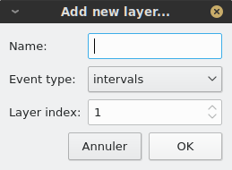

.. _sound_annot:

Sound annotation
================

This page explains how to work with **annotation views**, which are used to create, display and edit sound annotations. Annotation views share most of their features with **sound views**, and 
we recommend that you first get familiar with how sound views work (see :ref:`sound-view`) before reading this page. 

Opening annotation views
------------------------

Phonometrica currently supports two annotation formats: its own XML-based native format and Praat's TextGrid format. If you already have an annotation in
one of these formats in your current project, you can open it by double-clicking on it or right-clicking on it and choosing
``View file``. This will open a new annotation view in the viewer.

Note that to be able to view (or edit) an annotation, it must first be bound to a sound file. To do this, you can either select the annotation and the
sound you want to bind in the file manager, right-click on any of them, and choose ``Bind annotation to sound file``, or you can click on the annotation
in the file manager and click on the ``Bind...`` button in the information panel. Note that although you can have several annotations bound to the same
sound file, each annotation can be bound to one sound file at most.

Creating a new annotation
--------------------------

Phonometrica offers a complete environment for speech annotation, which allows you to create new annotations and edit existing ones.

Creating layers and events
~~~~~~~~~~~~~~~~~~~~~~~~~~

To create a new annotation, you must first import the sound you want to annotate into the current project, for example using the command ``File > Add file(s) to project...``.
Next, right-click on the sound file and choose ``Create annotation``: this will open a new annotation view in the viewer. Since your annotation is empty, the view will look similar to
a sound view, but it will contain a few additional buttons dedicated to sound annotation in its toolbar.

The first thing we need to do is to add one or more annotation **layers**. Each layer stores a specific type of speech **event**, and is relatively independent from the other layers
in the annotation. There are two types of events: **intervals** are used to identify a portion of the sound file, and have a start time and an end time (and hence a duration); **instants**
are used to stamp a specific point in the sound file. Intervals and instants cannot be mixed on a given layer: therefore, when you create a new layer, you need to decide whether it 
will store intervals or instants. You can create a new layer using the ``Add new layer...`` command from the layer menu |layer|. A new dialog will appear and will ask you the layer's
name (you can leave it empty), the layer's type (intervals vs instants) and the layer's index (by default, it will be added after all existing layers, if any).

Once the layer is created, it will appear below the sound plots. If it is an instant layer, it will be empty; otherwise, it will contain one interval spanning from the beginning to 
the end of the file. Whatever type of layer you created, you can create new events by adding **anchors**, which are time stamps in the sound file. Phonometrica's data model is based 
on **annotation graphs** [BIR2001]_, so annotations are represented as a single graph: time points (i.e. anchors) represent nodes in the graph, and events represent labeled arcs
between these nodes. This means that an event always "knows" whether it shares an anchor with another event on another layer: this makes it easy to represent hierarchical 
structures (e.g. words that contain syllables that contain segments) and alignment (e.g. words that are aligned with their part of speech).

To create one or more anchors, click on the ``Add anchors`` button |anchor|. You can then move your cursor anywhere in the layer you want to annotate and a moving anchor will follow
the mouse cursor: every time you click on the left button, a new anchor will be added where you click. Once you have added all the anchors you wanted, click again on the ``Add
anchor`` button. To remove one or more anchors, click on the ``Remove anchors`` button |remove|, click on the anchors you want to delete, and click again on the ``Remove
anchor`` button to let Phonometrica know that you have finished editing anchors.

By default, if you have more than one layer of the same type (i.e. two or more instant layers or two or more interval layers), Phonometrica will add (or remove) an anchor on all the 
instant layers if you added (or removed) an anchor on an instant layer, and on all the interval layers if you added (or removed) an anchor on an interval layer. This is because 
anchors are shared across layers. If you prefer to edit anchors on a single layer at a time, click on the ``Share/unshare anchors`` button |share|. The icon will become a broken
link |unshare|, which indicates that layers no longer share anchors. You can switch back and forth between the two modes (sharing and unsharing) at will, according to your needs.
Note that when anchors are not shared, you can still share new anchors across layers: whenever you add an anchor on a layer, a dotted gray line will be projected on the other layers. 
If you click on any of these temporary anchors, it will be changed to a permanent anchor. This allows you to have more control over which layers share which anchors.

Finally, you can move any anchor by clicking on it and dragging it with the mouse to the desired position. If anchors are shared, the anchor will be moved on all layers (of the same 
type) that share this anchor. If anchors are not shared, the anchor will be moved on a single layer at a time.

Labelling events
~~~~~~~~~~~~~~~~

Once you have created events on one or more layers, you will most likely want to label them. To do this, you can simply double-click on the event you want to edit: this will open 
a small dialog where you can input the event's label. Once you are done editing the label, press the ``Enter`` key to validate the label. You can cancel the editing by pressing
``Esc``.

Instead of using the mouse, you can edit events using the keyboard. First click on any event to give it focus. Once an event is focused, you can use the arrow keys to navigate 
in the annotation. The Up and Down arrows allow you to move to the previous and next layer, respectively, whereas the Left and Right arrows allow you to move to the previous and next 
event within a single layer. Once you have focused the event you want to edit, simply press ``Enter`` to open the event editor and press ``Enter`` again to validate or ``Esc`` to 
cancel the editing. 

If you are repeatedly editing events on a given layer and you are not satisfied with the event editor's position, you can move it up or down. Phonometrica will remember its vertical
position for each layer and will place it at the same vertical position the next time you edit an event on this layer. This allows you, for example, to make sure that the pitch track
is always visible while annotating prosody. 

Managing layers
~~~~~~~~~~~~~~~

The layer menu |layer| offers a number of options to manage layers. You can click on any layer and choose the appropriate command to rename, remove, duplicate or clear the content 
of a layer. In addition, the ``Select visible layers`` command allows you to selectively show and hide layers. This is particularly useful when you have many layers and you would 
like to focus on a specific subset.

Saving annotations
~~~~~~~~~~~~~~~~~~

To save an annotation, simply click on the ``Save annotation`` button |save| in the toolbar, or press ``Ctrl+S``. The annotation will be saved to Phonometrica's own native format (with a ``.phon-annot`` extension).
This format is based on the XML standard and uses the UTF-8 encoding: as a result, it can be opened in any text editor and can be easily processed by any XML-compliant piece of software.

In addition to the annotation graph itself, a native annotation file contains all the metadata associated with the file (properties, description, sound file). Therefore, you can easily share or move these files without
losing any information.

If you have modified several annotations, you can save them all at once using ``File > Save project`` (``Ctrl+Shift+S``), which will save
all unsaved changes in the project.

Importing and exporting annotations
~~~~~~~~~~~~~~~~~~~~~~~~~~~~~~~~~~~~

In addition to its own native annotation format (``.phon-annot`` extension), Phonometrica allows you to seamlessly work with annotations in the widely used TextGrid format (``.TextGrid`` extension),
which is produced by the `Praat <http://www.praat.org>`_ program. Phonometrica can read TextGrid files encoded in UTF-8 or UTF-16 and can write them
(currently, in UTF-8 only).

To convert a native Phonometrica annotation to a TextGrid, right-click on it in the file manager and choose ``Save as Praat TextGrid...``. Likewise,
to convert a TextGrid to a Phonometrica annotation, right-click on it and choose ``Save as Phonometrica annotation...``. Both commands will give you
the opportunity to import the converted file into the current project. When converting, Phonometrica
copies the file's properties, description, and sound file binding to the new file, so you do not lose
any metadata in the process.

TextGrid files can be visualized and edited like native annotations, but please note that due to the limitations of the TextGrid format, metadata will
*not* be stored in the TextGrid file itself. Instead, they will be stored inside the project file alongside the annotation.

You can also export annotations to plain text using ``File > Export > Export annotation(s) to plain text...``.

Bookmarking events
~~~~~~~~~~~~~~~~~~

While working on an annotation, you can bookmark any event so that you (or a collaborator) can
return to it later. To create a bookmark, click on an event to focus its layer, then click on
the |bookmark| **Bookmark** button in the toolbar or press ``Ctrl+B``. A dialog opens where you
can set the bookmark's title (pre-filled with the selected event's text) and add free-form notes
— for example, a reminder about why the token deserves a second look, or a reference to a
coding decision.

Bookmarks appear under the **Bookmarks** folder in the project tree. Their title is used as the
label in the tree, and hovering over an entry displays a tooltip showing the file name, the
layer and time span, and the notes you entered. Double-clicking a bookmark reopens the
annotation at the bookmarked location.

Bookmarks created from an annotation view are analogous to those created from a concordance
(see :ref:`concordance-view`): both are stored in the same folder and serialized to the project
file. The only difference is that annotation-view bookmarks have no surrounding "keyword in
context" window — there is no query — so the tooltip shows the layer and time span instead.

Opening annotations in Praat
~~~~~~~~~~~~~~~~~~~~~~~~~~~~~

If you have Praat installed and configured (see :ref:`praat-integration`), you can open the current
annotation and its bound sound file directly in Praat. Right-click anywhere in the annotation view
and choose **Open in Praat**, or use the corresponding command in the toolbar. This sends both files
to Praat so that you can view the annotation overlaid on the sound in Praat's editor.

.. _annotation-file-operations:

Annotation file operations
--------------------------

Phonometrica lets you transform annotations as files: making copies, pulling layers out, slicing
to a sub-interval, merging compatible annotations, and concatenating them end-to-end. All these
operations produce a **new** file on disk and add it to the current project. They are accessible
from the context menu in the file manager when one or more annotations are selected. Each operation
inherits the source's properties, description, and (where it still applies) sound binding; for
multi-source operations, properties from later inputs override earlier ones on category collision.
By default, the result keeps the source's format (native ``.phon-annot`` or Praat TextGrid); when the
sources disagree, a format selector appears in the dialog.

Duplicate
~~~~~~~~~

Right-click an annotation and choose **Duplicate**. A copy is created next to the source with the
suffix ``_copy``, in the same format, with the same properties, description, and sound binding.
This is the fastest way to fork an annotation before destructive edits.

Extract layers
~~~~~~~~~~~~~~

When you want only a subset of an annotation's layers (for example, the phone and word layers
from a richer annotation), right-click and choose **Extract layers...**. The dialog lists every
layer with its label and kind (intervals vs. instants); check the ones you want. The selected
layers are copied into a new annotation in display order. The sound binding is inherited because
the duration is unchanged.

Extract slice
~~~~~~~~~~~~~

To cut out a time region, right-click and choose **Extract slice...**. The dialog has plain text
fields for the start and end times in seconds (so you can paste exact values from Praat or elsewhere)
and a checkbox controlling boundary handling for partial events:

- **Clip events that straddle the boundary** (default): events partially inside the slice are
  kept but clipped to the slice boundaries.
- **Off**: such events are dropped entirely.

Instants are never partial: an instant at time *t* is kept iff *t* lies in [start, end] inclusive.
Times in the resulting annotation are shifted so the slice starts at zero.

When the source annotation is bound to a sound, the dialog also lets you choose what to extract:
**Annotation only**, **Sound only**, or **Both**. In the **Both** mode, the matching portion of the
bound sound is extracted to a new audio file and the new annotation is automatically bound to it.
You can right-click a sound directly to extract a sound slice without involving an annotation.

Merge annotations
~~~~~~~~~~~~~~~~~

When two or more annotations cover the same time range with different layers (for example, one
annotation has phones and words, another adds POS tags), you can combine them into a single
annotation. Multi-select the annotations in the file manager, right-click, and choose
**Merge annotations...**. The dialog lets you pick one as the **base** (its sound binding and
description are inherited); the layers of the others are appended after the base's. All sources
must have the same effective duration within 1 ms — the bound sound's duration if available,
otherwise the maximum event end time. Any annotation that doesn't match the base is listed in
red and the operation is blocked until you cancel and resolve the mismatch.

If two layers happen to have the same label, the duplicates are renamed ``label (2)``, ``label (3)``,
and so on.

Concatenate annotations
~~~~~~~~~~~~~~~~~~~~~~~

To glue annotations end-to-end (typically when you've split a long recording into chunks for
annotation and now want a single file), multi-select them, right-click, and choose
**Concatenate annotations...**. The dialog shows the sources in a list you can reorder by drag
and drop; the first source provides the layer labels, format, properties, and description for the
result. All sources must share the same number of layers and matching layer kinds (interval vs.
instant) at each index; layer-count mismatches are reported at OK time by the underlying operation.

For annotations bound to a sound, the source's duration is taken from the sound. For unbound
sources, the dialog shows one duration spinner per unbound annotation under "Durations for unbound
annotations" so you can give each one an explicit duration in seconds — inferring from the maximum
event end is unreliable when an annotation has meaningful trailing silence. Events from source *i*
are shifted by the cumulative duration offset; adjacent intervals at boundaries are kept distinct
rather than merged, since their labels may differ.

The result is not automatically bound to any sound. If you want a concatenated annotation that is
bound, concatenate the matching sound files separately (see :ref:`sound-file-operations`) and bind
the result manually.

References
----------

.. [BIR2001] Bird, Steven & Mark Liberman. 2001. A Formal Framework for Linguistic Annotation. *Speech Communication* 33(1–2). 23–60.

.. |share| image:: ../icons/link.svg
    :height: 16px
    :width: 16px

    

