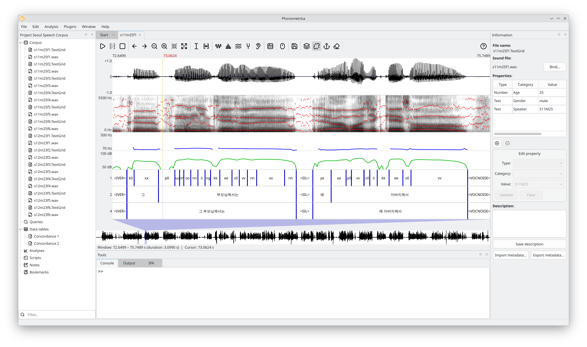

.. Phonometrica documentation master file, created by
   sphinx-quickstart on Sun Apr  8 05:51:44 2018.
   You can adapt this file completely to your liking, but it should at least
   contain the root `toctree` directive.

   
============
Phonometrica
============

Overview
========

Phonometrica is a free, open-source software platform for the annotation and analysis of speech corpora.
It offers a user-friendly interface to manage, annotate, analyze and query language corpora.
It is particularly well suited for dealing with time-aligned data, and integrates corpus management,
acoustic analysis, and statistical modeling into a single workflow. The main features it offers are:

   * **Project management**: organize files into projects with extensible metadata (properties).
   * **Sound visualization and analysis**: visualize waveforms, spectrograms, pitch tracks, formant tracks, intensity curves, spectral slices, and spectral moments.
   * **Sound annotation**: create and edit multi-layer annotations based on annotation graphs; import and export Praat TextGrids.
   * **Speech processing**: detect silences to pre-segment recordings for manual annotation; automatic speech recognition via whisper.cpp (runs locally on CPU, requires a model file).
   * **Text and acoustic queries**: search for text patterns across annotation layers using simple or complex multi-constraint queries; extract formant, pitch, intensity, and spectral moment measurements.
   * **Concordance and dataset views**: browse, filter, recode, transform, and merge query results; vowel normalization (Lobanov, Nearey, Watt & Fabricius); toggle between wide and long formats; perform set operations on concordances.
   * **Statistical analysis (preview/beta)**: frequentist and Bayesian linear, logistic, Poisson, negative binomial, beta, and robust Student *t* regression models, including mixed-effects models and generalized additive models (GAMs); post-hoc and diagnostic tests; exploratory visualizations.
   * **Scripting engine**: Phonometrica can be configured and extended with an easy-to-use scripting language, JSON-based plugins, and coding protocols.
   * **Research notes**: keep free-form rich-text notes alongside your data, organized within the project.
   * **Standard-based**: Phonometrica files are encoded in XML and Unicode.
   * **Interaction with Praat**: Phonometrica can read and write TextGrid files and open files directly in Praat from the file manager, annotation views, and concordance views.

Phonometrica runs on all major platforms (Windows, macOS and GNU/Linux) and is freely available under the terms of the
GNU General Public License (version 3). The latest version can be downloaded from http://www.phonometrica-ling.org.
The source code is available at https://github.com/jeychenne/phonometrica.
If you have questions, problems, or would like to report a bug, please contact us at julien.eychenne@usherbrooke.ca.

Download
========

Phonometrica |release|
----------------------

-  Windows:
   `setup\_phonometrica.exe <https://github.com/jeychenne/phonometrica/releases/download/v0.9.0/setup_phonometrica.exe>`__
-  macOS:
   `Phonometrica-0.9.0.dmg <https://github.com/jeychenne/phonometrica/releases/download/v0.9.0/Phonometrica-0.9.0.dmg>`__
-  Linux (Debian/Ubuntu):
   `phonometrica-0.9.0.deb <https://github.com/jeychenne/phonometrica/releases/download/v0.9.0/phonometrica_0.9.0-1_amd64.deb>`__
-  source code: `phonometrica-0.9.0.zip <https://github.com/jeychenne/phonometrica/archive/v0.9.0.zip>`__ | `phonometrica-0.9.0.tar.gz <https://github.com/jeychenne/phonometrica/archive/v0.9.0.tar.gz>`__

Documentation
-------------

Phonometrica's documentation is available from its `website <https://www.phonometrica-ling.org>`_ file.
It is also accessible from within the application via the **Help** menu and help buttons available in each view.

Topics
======

.. toctree::
   :maxdepth: 1
	
   intro/install
   intro/start
   intro/preferences
   sound
   annotation
   speech
   query
   concordance
   dataset
   vowel_normalization
   analysis
   transform
   notes
   intro/praat
   intro/shortcuts
   scripting/index
   scripting/plugins
   License <about/license>
   about/acknowledgements
   about/release-notes

.. _how-to-cite:

How to cite
===========

To cite Phonometrica, please use the following reference [EYC2025]_:

.. [EYC2025] Eychenne, Julien & Léa Courdès-Murphy (2025). Annotation et analyse de données sociophonologiques sur grands corpus : présentation de la plateforme Phonometrica. In Wim Remysen & Hélène Blondeau (eds.) *(Re)donner la parole aux corpus montréalais : Regards rétrospectifs et prospectifs*. Montreal: Presses Universitaires de Montréal, pp. 255–270.

You may also cite the earlier conference paper [EYC2019]_:

.. [EYC2019] Eychenne, Julien & Léa Courdès-Murphy (2019). Phonometrica: an open platform for the analysis of speech corpora. *Proceedings of the Seoul International Conference on Speech Sciences 2019*, Seoul National University, pp. 107–108.
