.. _page-user-dialogs:

User dialogs
============

Phonometrica allows you to create custom dialogs that you can integrate into your scripts.
These can be used to obtain some input from users of your scripts.
User dialogs are created with the ``create_dialog()`` function, which takes as input a
``Table`` describing the user dialog, and returns a ``Table`` containing the user's
choices, if any.

Creating a dialog
-----------------

We will start with a minimalist dialog that only displays some text. The dialog is described
by a table whose keys configure the window; the most important ones are ``title``, which
corresponds to the title of the window, and ``items``, a list of user interface components
displayed from top to bottom. Each item is itself a ``Table``: its ``type`` key indicates
which type of user interface component the item represents, and the other keys
depend on the type of component (see below). Here, we are simply displaying a label with a
``text`` key.

.. code:: phon

    {
        "title": "My first dialog",
        "items": [
            { "type": "label", "text": "My first label" }
        ]
    }

There are several optional keys that can be used to customize our dialog. ``width``
and ``height`` allow you to set the initial width and height of the dialog (in pixels), whereas
``yes_no`` can be set to ``true`` to use ``Yes/No`` buttons instead of the default ``OK/Cancel``.

.. code:: phon

    {
        "title": "My first dialog",
        "width": 300,
        "height": 200,
        "yes_no": true,
        "items": [
            { "type": "label", "text": "My first label" }
        ]
    }

Once we have created a table describing our dialog's user interface, we can pass it
to the ``create_dialog()`` function.

.. code:: phon

    var ui = {
        "title": "My first dialog",
        "width": 300,
        "height": 100,
        "yes_no": true,
        "items": [
            { "type": "label", "text": "My first label" }
        ]
    }

    create_dialog(ui)

The resulting dialog will look something like that:

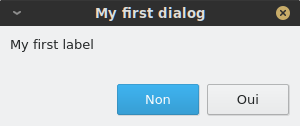

If the user presses ``OK`` (or ``Yes`` if ``yes_no`` is ``true``), ``create_dialog()`` will return a ``Table`` containing the user's input (which will be empty
in this case); if the user presses ``Cancel`` (or ``No``), it will return the value ``null``.

Note: for compatibility with older scripts, ``create_dialog()`` also accepts a ``String`` containing a table specification (for instance the contents of a JSON
file); the string is evaluated as Phonometrica code and must produce a table. New scripts should simply pass a ``Table`` directly.

User interface components
-------------------------

Each user interface component has its own keys, but there are a few important commonalities. Components which accept some user input have a ``name``
key: this will be used as a key in the ``Table`` returned by ``create_dialog()`` to retrieve the corresponding value. In addition, components that
accept a default value have an optional ``default`` key that allows you to explicitly set a default value.

Label
~~~~~

A **label** must have its ``type`` key set to ``label``. A label has one additional required key, ``text``, which corresponds to the text that
is displayed inside the label.

.. code:: phon

    { "type": "label", "text": "This is a label" }

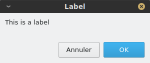

Button
~~~~~~

A **button** must have its ``type`` key set to ``button``. You must specify
a ``label`` key, which is the text that will appear on the button. You may additionally provide an ``action`` key, which can be any valid string of
Phonometrica code: whenever the button is pressed, this code is executed. (If the code throws an error, the error message is displayed in a warning box
instead of interrupting the dialog.)
By default, unless the button is stored in a container, it will fill the whole width of the dialog. You can use the optional ``position`` key to
make it smaller and control its position. Valid values are ``left``, ``center`` and ``right``. If the button is inside of a container, the ``position`` key
is ignored. A button contributes no entry to the result table.

.. code:: phon

    { "type": "button", "label": "test", "action": "print('button clicked!')", "position": "left" }

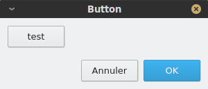

File selector
~~~~~~~~~~~~~

A **file selector** must have its ``type`` key set to ``file_selector``. A file selector combines a ``Browse...`` button, which lets the user select
a file (which may or may not exist) and a field which displays the file's path.  You must specify a ``name`` key, which is the key that will be used in the result table to retrieve the file selector's value (the selected path, as a ``String``), and a ``title`` which will
be displayed in the file selection dialog that opens when the user presses the ``Browse...`` button. You can specify a
``default`` key (as a string) to pre-fill the path field; if no default value is provided, the file selector's field will be empty. Additionally, you can specify a ``filter`` key
that will be used to restrict the type of files that can be selected. For example, the filter ``"CSV (*.txt *.csv *.tsv)"`` would accept
all CSV files (comma-separated value) that have ``.txt``, ``.csv`` or ``.tsv`` extension. Finally, you can set the optional ``save`` key to ``true`` to
display a *save file* dialog (suitable for choosing an output file) instead of the default *open file* dialog.

.. code:: phon

    { "type": "file_selector", "name": "path", "title": "Select text file...", "default": "output.txt", "filter": "CSV (*.txt *.csv *.tsv)" }

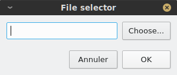

Field
~~~~~

A **field** must have its ``type`` key set to ``field``. A field can be used to input a line of text.
You must specify a ``name`` key, which is the key that will be used in the result table to retrieve the field's value (a ``String``). Additionally,
you may specify a ``default`` value.

.. code:: phon

    { "type": "field", "name": "field1", "default": "some default text" }

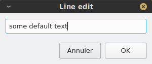

Check box
~~~~~~~~~

A **check box** must have its ``type`` key set to ``check_box``. It lets you retrieve a Boolean value from the user: when the check box is checked,
the value ``true`` is returned, whereas ``false`` is returned if the box is unchecked. You must specify a ``name`` key, which is the key that will
be used in the result table to retrieve the check box's value, and you will usually want to provide a ``text`` key, which is the text that will be displayed next to the check box.
In addition, you may specify a ``default`` value, which must be a ``Boolean`` (the box is unchecked by default).

.. code:: phon

    { "type": "check_box", "name": "overwrite", "text": "Overwrite file if it exists", "default": true }

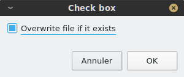

Check list
~~~~~~~~~~

A **check list** must have its ``type`` key set to ``check_list``. It is used to display a list of values that can be checked. You must specify a
``name`` key, which is the key that will be used in the result table to retrieve the check list's values. You must also provide a list of ``values``
as a ``List`` of strings: all checked values will be stored in the return value (again, as a ``List`` of strings). In addition to the list of values,
you may specify a list of ``labels``: in this case, labels will be displayed instead of values and values will be shown as tool tips when the user hovers
their mouse over the label. This feature can be used to display shorter values than those we actually want to store.

.. code:: phon

    { "type": "check_list", "name": "annotations",
      "labels": [ "nzdajm1vg.TextGrid", "nzdajm1cg.TextGrid", "nzdajm1fg.TextGrid", "nzdajm1tg.TextGrid" ],
      "values": [
         "/home/julien/PAC/JM/nzdajm1vg.TextGrid",
         "/home/julien/PAC/JM/nzdajm1cg.TextGrid",
         "/home/julien/PAC/JM/nzdajm1fg.TextGrid",
         "/home/julien/PAC/JM/nzdajm1tg.TextGrid"
      ]
    }

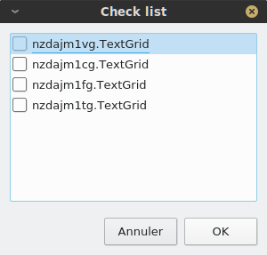

Radio buttons
~~~~~~~~~~~~~

A group of **radio buttons** must have its ``type`` key set to ``radio_buttons``. It is used to display a number of exclusive options, where only one
can be selected at a time. You must specify a ``name`` key, which is the key that will be used in the result table to retrieve the index of the
selected value (as an ``Integer``, starting from 1). You must also provide a list of ``values`` as a ``List`` of strings. The index of the default value can be specified with the ``default``
key, which must be an integer (the first button is selected by default). Finally, you can add a ``title`` key to provide a label for the button group.

.. code:: phon

    { "type": "radio_buttons", "name": "tough_choice", "values": [ "blue pill", "red pill" ], "title": "Tough choice", "default": 1 }

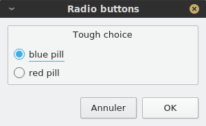

Combo box
~~~~~~~~~

A **combo box** is conceptually similar to a group of radio buttons in that it allows you to select one among several options. The choices are displayed as a list,
instead of a group of buttons. A combo box must have its ``type`` key set to ``combo_box``. You must specify a ``name`` key, which is the key that will be used in the result table to retrieve the index of the
selected value (as an ``Integer``, starting from 1). You must also provide a list of ``values`` as a ``List`` of strings. The index of the default value can be specified with the ``default``
key, which must be an integer.

.. code:: phon

    { "type": "combo_box", "name": "choice", "values": [ "blue pill", "red pill" ], "default": 2 }

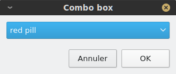

Container
~~~~~~~~~

A **container** must have its ``type`` key set to ``container``. A container is not a visible component, but is used to pack components together
horizontally (by default) or vertically. A container must have an ``items`` key, which is a list of components. You can use the ``orientation``
key to control the container's packing policy. It accepts two values: ``horizontal`` or ``vertical``.

.. code:: phon

    { "type": "container", "items": [
        { "type": "button", "label": "button 1", "action": "info('A useless button!')", "position": "left" },
        { "type": "button", "label": "button 2", "action": "info('Another useless button!')", "position": "left" }
    ]}

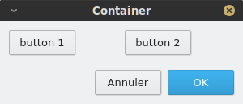

Stretch
~~~~~~~

A **stretch** must have its ``type`` key set to ``stretch``. It is a special component that can be put inside a container to fill unused space.
It has no key beside its type.

.. code:: phon

    { "type": "container", "items": [
        { "type": "button", "label": "button 1", "action": "info('A useless button!')", "position": "left" },
        { "type": "button", "label": "button 2", "action": "info('Another useless button!')", "position": "left" },
        { "type": "stretch" }
    ]}

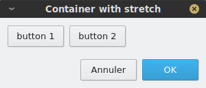

Spacing
~~~~~~~

A **spacing** must have its ``type`` key set to ``spacing``. It is a special component that can be put inside a container to separate components.
You must specify its ``size`` key, which is an integer that represents the size of the spacing (in pixels).

.. code:: phon

    { "type": "container", "items": [
        { "type": "button", "label": "button 1", "action": "info('A useless button!')", "position": "left" },
        { "type": "spacing", "size": 20 },
        { "type": "button", "label": "button 2", "action": "info('Another useless button!')", "position": "left" },
        { "type": "stretch" }
    ]}

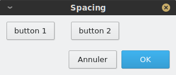

Putting it all together
-----------------------

As an illustration, we will show how "Transphon", the module that allows annotations to be exported to plain text, is implemented. We could store the user
interface in a separate JSON file and load it from a Phonometrica script, but since the user interface is relatively simple, we will create it directly
in the script as a table literal. This has two advantages: it allows us to intersperse comments in the user interface, which JSON doesn't allow, and it lets
us compute parts of the interface with ordinary code, as we do below for the check list of annotations.

Here is the part of the script that corresponds to the creation of the user interface:

.. code:: phon

    # Set up the user interface as a Table.
    var ui = {
        "title": "Transphon",
        "width": 300,
        "items": [
            { "type": "label", "text": "Choose output file:" },
            { "type": "file_selector", "name": "path", "title": "Select text file..." },
            { "type": "label", "text": "Select layers separated by a comma, or leave empty to process all layers:" },
            { "type": "field", "name": "layers", "default": "1" },
            { "type": "label", "text": "Choose annotations:" },
            # Annotations will be inserted here
            { "type": "label", "text": "Choose event separator:" },
            { "type": "radio_buttons", "name": "separator", "values": ["space", "new line", "none"] }
        ]
    }

    # Build the check list for annotations
    var labels = []
    var values = []

    for annot in get_annotations() do
        var path = annot.path
        # This is the real value we are interested in
        append(values, path)
        # This is the label that will be displayed
        append(labels, get_base_name(path))
    end

    # Create the item and insert it at position 6 in the list of items
    var item = { "type": "check_list", "name": "annotations", "labels": labels, "values": values }
    insert(ui["items"], 6, item)

    # `result` contains a Table if the user pressed "OK", or null otherwise.
    var result = create_dialog(ui)

    if result then
        # Process the result. Here we will simply print it.
        print(to_json(result))
    end

And here is the dialog that appears when the script is run:

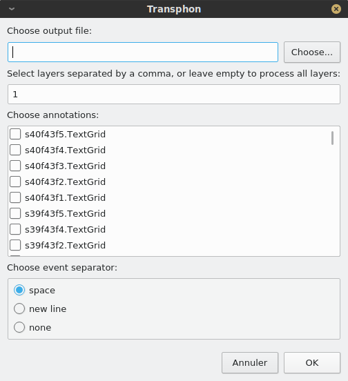
